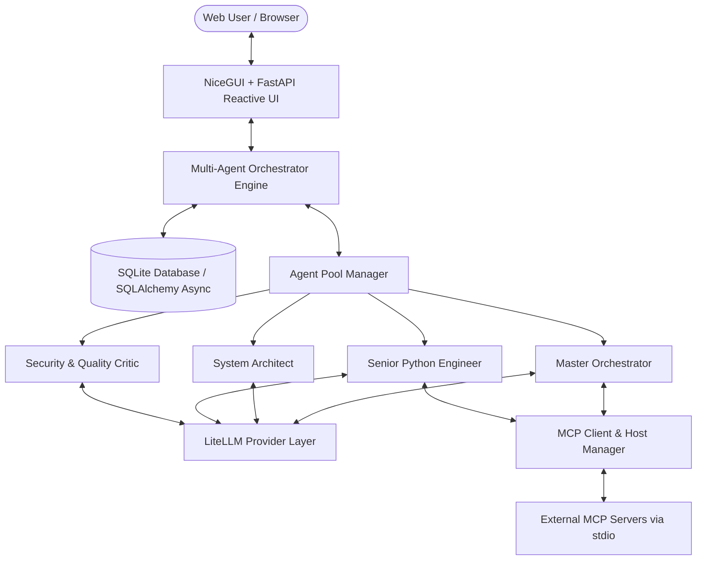

# 🤖 Multi-Agent Orchestrator Platform

> **MCP 도구를 활용하는 반응형 멀티 에이전트 협업 & 토론 웹 애플리케이션**  
> Dynamic Agent Profiling via `conf.toml`, MCP Tool Integration, Multi-Model LLM Abstraction (LiteLLM), StateGraph Orchestration, and NiceGUI + FastAPI Reactive Web Interface.

---

## 🌟 주요 특징 (Key Features)

1. **`conf.toml` 기반 동적 에이전트 프로파일링**:
   - 시스템 기동 시 `conf.toml` 설정 파일로부터 에이전트 풀(Agent Pool)과 MCP 서버를 동적으로 등록.
   - `${OPENAI_API_KEY}`, `${ANTHROPIC_API_KEY}` 등 환경 변수 동적 치환 지원.
2. **Model Context Protocol (MCP) 내장 호스트 & 도구 연동**:
   - Filesystem · Memory(지식 그래프) · Git · Python 코드 실행 샌드박스 MCP 서버와 JSON-RPC stdio 통신.
   - 공식 레퍼런스 서버(Node/Python)와 자체 샌드박스를 **번들로 동봉**하여 폐쇄망에서도 도구 사용 가능.
   - 도구 검색 및 Function Calling 스키마 자동 변환, 실행 결과(Observation) 피드백.
3. **다양한 LLM 프로바이더 추상화 (LiteLLM)**:
   - OpenAI (`gpt-4o`), Anthropic (`claude-3-5-sonnet`), Google (`gemini-1.5-pro`), Ollama 등 통합 지원.
   - `[llm]` 전역 섹션에서 **API URL(`api_base`), 모델 명, API 버전, provider, timeout/재시도, 커스텀 헤더**를 지정하고 모든 에이전트가 상속.
   - 사내 OpenAI 호환 게이트웨이 · vLLM · LM Studio · Ollama 등 **API 키 없는 로컬 엔드포인트도 그대로 사용 가능**.
   - **Sequential Thinking(단계적 사고)** 을 `prompt` / `native` / `mcp` 3가지 모드로 에이전트별 설정.
   - 엔드포인트에 닿지 못하면 **대체 답변을 지어내지 않고** 해당 발언 자리에 연결 실패 사실을 그대로 기록합니다.
4. **토론은 브라우저와 분리되어 백그라운드에서 진행**:
   - 페이지를 새로고침하거나 페르소나 화면에 다녀와도 진행 중인 토론이 끊기지 않습니다.
   - 돌아오면 그동안 오간 발언과 진행률이 이어서 표시되고, 생성 중이던 발언은 이어서 스트리밍됩니다.
   - 사이드바의 세션 목록과 페르소나 화면에 "진행 중" 표시가 뜹니다.

5. **세션별 페르소나 & 시스템 프롬프트 (첫 대화 시 고정)**:
   - `/personas/{session_id}` 편집 페이지에서 에이전트의 이름·역할·시스템 프롬프트를 세션마다 다르게 지정.
   - 첫 유저 메시지가 기록되는 순간 전 에이전트의 페르소나가 DB 에 스냅샷되고 잠깁니다.
   - 세션을 나중에 다시 열면 그때 저장된 페르소나로 이어서 토론합니다 (`conf.toml` 이 바뀌었어도 유지).
6. **멀티 에이전트 토론 & 상태 머신 오케스트레이션**:
   - **Master Orchestrator**: 목표 분해, 발언자 선정, 토론 중재, 합의 검증 및 최종 산출물 합성.
   - **3가지 토론 전략**: 자유 토론 (`free_debate`), 순차 검증 (`sequential_review`), 디베이트 (`adversarial_debate`).
   - 무한 루프 방지를 위한 `max_rounds` 및 `is_consensus_reached` 종료 보장.
7. **반응형 모던 Web GUI (FastAPI + NiceGUI)**:
   - **좌측 사이드바**: 세션 히스토리, 신규 생성(`+ New Chat`), 이름 변경, 삭제.
   - **상단 제어 패널**: 에이전트 온/오프 토글, 라운드 제한 슬라이더, 전략 선택, 세션별 커스텀 지침.
   - **메인 토론 피드**: 에이전트별 색상/아바타 구분 대화창, 접이식(Accordion) MCP 도구 호출 로그.
   - **우측 산출물 뷰어**: 최종 종합 보고서(Markdown), 소스코드(Code), Mermaid 아키텍처 다이어그램 탭 및 원클릭 복사/다운로드.
8. **SQLite 영구 저장소 (SQLAlchemy Async)**:
   - 세션, 메시지, 도구 호출 기록, 최종 아티팩트 영구 보존.

---

## 🏗️ 시스템 아키텍처 (Architecture)



---

## 📁 프로젝트 구조 (Directory Structure)

```
MultiAgentOrchestrator/
├── conf.example.toml         # 설정 템플릿 (저장소에 커밋되는 원본)
├── setup_mcp.py              # 개발 PC용 MCP 서버 일괄 설치
├── package_offline.py        # 폐쇄망 배포 번들 패키징 (런타임 + MCP 서버 동봉)
├── package_source.py         # 소스·설정만 패키징 (런타임 제외, 갱신 반입용)
├── conf.toml                 # 실제 시스템 설정 파일 (로컬 전용, .gitignore 대상)
├── .env.example              # 환경 변수 템플릿
├── requirements.txt          # 파이썬 의존성 패키지
├── README.md                 # 프로젝트 문서
├── mcp_node/                 # 공식 Node MCP 서버 (npm install 로 생성, .gitignore 대상)
├── mcp_sandbox/              # AirgappedPySandbox (git clone 으로 생성, .gitignore 대상)
├── workspace/                # 에이전트 공용 작업 공간 (.gitignore 대상)
├── app/
│   ├── main.py               # FastAPI + NiceGUI 실행 엔트리포인트
│   ├── config.py             # TOML 로더, 환경변수 치환 및 Pydantic 검증
│   ├── database/             # SQLite & SQLAlchemy 비동기 ORM
│   │   ├── models.py         # Session, Message, ToolCallRecord, Artifact, SessionAgent 모델
│   │   └── session.py        # Async Engine 및 세션 관리
│   ├── mcp/                  # MCP Host & Tool Integration
│   │   ├── client.py         # Stdio MCP Client 프로세스 관리자
│   │   └── manager.py        # 도구 검색 및 Function Calling 디스패치
│   ├── agents/               # 에이전트 및 LLM 계층
│   │   ├── base.py           # Agent 모델 및 UI 스타일 매핑
│   │   ├── personas.py       # 세션별 페르소나 해석·저장·고정
│   │   ├── llm.py            # LiteLLM 호출기, Tool 루프, LLMUnavailableError
│   │   └── pool.py           # 동적 에이전트 풀 레지스트리
│   ├── orchestration/        # 멀티 에이전트 토론 상태 머신
│   │   ├── state.py          # DebateState, DebateMessage, ArtifactItem
│   │   ├── strategies.py     # 자유 토론, 순차 검증, 디베이트 전략
│   │   ├── engine.py         # 오케스트레이션 엔진 & 산출물 합성기
│   │   └── runner.py         # 세션별 백그라운드 토론 태스크 & 재접속 스냅샷
│   └── ui/                   # NiceGUI 반응형 웹 UI
│       ├── app.py            # UI 페이지 레이아웃 및 리액티브 바인딩
│       ├── personas_page.py  # /personas/{session_id} 페르소나 편집 페이지
│       ├── theme.py          # Quasar CSS 스타일 & 컬러 팔레트
│       └── components/       # UI 컴포넌트
│           ├── sidebar.py    # 세션 히스토리 사이드바
│           ├── roster.py     # 에이전트 로스터 및 토론 제어판
│           ├── chat_feed.py  # 대화 타임라인 & MCP 도구 아코디언
│           └── artifact_viewer.py # 탭형 산출물 뷰어 (Code, Markdown, Mermaid)
└── tests/                    # 자동화 테스트 스위트
    ├── test_config.py
    ├── test_personas.py       # 페르소나 편집 → 고정 → 재개 수명주기
    ├── test_llm_settings.py   # [llm] 상속, 엔드포인트/단계적 사고 설정
    ├── test_db.py
    ├── test_mcp.py
    └── test_orchestrator.py
```

---

## 🚀 시작하기 (Getting Started)

### 1. 의존성 설치
```bash
pip install -r requirements.txt
```

### 1-1. MCP 서버 준비
`conf.toml` 이 기본으로 켜 두는 MCP 서버를 한 번에 준비합니다 (인터넷 필요, 최초 1회).
```bash
python setup_mcp.py
```
- `./workspace` 생성 및 **git 저장소 초기화** — git MCP 서버는 유효한 git 저장소가 아니면 기동에 실패합니다
- `./mcp_node` 에 공식 Node MCP 서버 설치 (filesystem / memory / sequential-thinking, Node.js 필요)
- `./mcp_sandbox` 에 [AirgappedPySandbox](https://github.com/HaJaehee/AirgappedPySandbox) 체크아웃

Node 를 쓰지 않거나 샌드박스가 필요 없으면 `--skip-node` / `--skip-sandbox` 를 붙이고,
해당 서버는 `conf.toml` 에서 `enabled = false` 로 꺼두세요.

### 2. 설정 파일 준비
`conf.toml` 은 로컬 전용 파일이라 저장소에 포함되지 않습니다. 템플릿을 복사해서 시작하세요.
```bash
cp conf.example.toml conf.toml
```

### 3. 환경 변수 설정 (선택사항)
`.env.example`을 복사하여 `.env`를 생성하고 엔드포인트와 키를 입력합니다.
```bash
cp .env.example .env
```
```dotenv
LLM_API_BASE=http://localhost:1234/v1     # 사내 게이트웨이 / vLLM / LM Studio / Ollama
LLM_MODEL=openai/qwen2.5-coder-32b        # 모델 명
LLM_API_KEY=                              # 키가 필요 없는 서버라면 비워두세요
```
*(엔드포인트가 없으면 에이전트는 발언하지 못하고, 그 자리에 "연결 끊김" 이 기록됩니다. 대체 답변을 지어내지 않습니다.)*

### 4. 애플리케이션 실행
```bash
python -m app.main
```
접속 주소는 기동 로그의 `Web UI: http://...` 줄에 표시됩니다. 주소는 `conf.toml` 의
`[app] host / port` 를 따르며, 이 값은 `.env` 의 `APP_HOST` / `APP_PORT` 로도 덮어쓸 수 있습니다.
실행 스크립트에 주소를 하드코딩하지 않으므로 포트를 바꾸려면 한 곳만 고치면 됩니다.

```toml
[app]
host = "${APP_HOST:-127.0.0.1}"
port = "${APP_PORT:-8000}"
```

---

## 🧪 테스트 실행 (Running Tests)

```bash
pytest -v tests/
```

---

## ⚙️ `conf.toml` 커스텀 가이드

### 전역 LLM 설정 `[llm]`

`[llm]` 섹션의 값은 각 에이전트가 같은 항목을 직접 지정하지 않는 한 **모든 에이전트에 상속**됩니다.
따라서 사내 게이트웨이나 로컬 LLM 서버를 쓸 때는 `[llm]` 한 곳만 고치면 됩니다.

```toml
[llm]
model = "openai/qwen2.5-coder-32b"          # 모델 명
api_base = "https://llm-gateway.mycorp.com/v1"  # LLM API URL (api_url / base_url 도 동일)
api_key = "${CORP_LLM_TOKEN}"               # 로컬 모델이면 비워두어도 됩니다
api_version = "2024-10-21"                  # Azure OpenAI 전용
provider = "openai"                          # LiteLLM provider 강제 지정 (선택)
temperature = 0.4
max_tokens = 4096
max_context_window = 128000
timeout = 120            # 요청 타임아웃(초)
num_retries = 2          # 재시도 횟수
drop_params = true       # 엔드포인트가 모르는 파라미터 자동 제거 (로컬 모델 호환성)
max_tool_iterations = 5  # 한 턴에서 허용할 MCP 도구 루프 횟수
extra_headers = { "X-Org-Id" = "${MY_ORG_ID}" }
extra_body = { "user" = "multiagent-orchestrator" }
```

> **호출 모드 판정**: `api_base` 또는 `api_key` 중 하나라도 설정되어 있으면(또는 모델이 `ollama/`, `ollama_chat/`, `lm_studio/` 로 시작하면) 실제 LLM 을 호출합니다.
> 둘 다 없으면 그 에이전트는 발언 차례에 실패하고, 토론 기록에 연결 실패 사실이 남습니다.
> API 키가 필요 없는 로컬 서버는 `api_base` 만 지정하면 그대로 사용할 수 있습니다.

### Sequential Thinking (단계적 사고)

```toml
[llm.sequential_thinking]        # 또는 [agents.<key>.sequential_thinking]
enabled = true
mode = "prompt"                  # "prompt" | "native" | "mcp"
max_steps = 5
show_steps = true                # false 면 최종 결론만 피드에 노출
reasoning_effort = "high"        # native 모드: minimal | low | medium | high
thinking_budget_tokens = 8192    # native 모드: 확장 사고 토큰 예산 (Anthropic 계열)
mcp_server = "sequential_thinking"  # mcp 모드에서 사용할 MCP 서버 키
# prompt_template = """...{max_steps}..."""   # 프로토콜 문구 직접 작성
```

| mode | 동작 | 적용 대상 |
|------|------|-----------|
| `prompt` | 단계적 사고 프로토콜을 시스템 프롬프트에 주입 | 모든 모델 (로컬 포함) |
| `native` | `reasoning_effort` / `thinking` 파라미터를 실제 요청에 전달 | 추론 지원 모델 |
| `mcp` | `@modelcontextprotocol/server-sequential-thinking` 도구를 강제 사용 | MCP 서버 활성화 필요 |

에이전트 블록의 `[agents.<key>.sequential_thinking]` 은 전역 값과 **키 단위로 병합**되므로,
바꾸고 싶은 항목만 적으면 나머지는 `[llm.sequential_thinking]` 값을 그대로 사용합니다.

### 에이전트 페르소나 (세션별 오버라이드)

`conf.toml` 의 `[agents.*]` 는 **서버 전역 기본값**입니다. 세션마다 다른 인격으로 토론시키려고
서버를 재기동할 필요는 없습니다.

로스터 패널의 **페르소나 편집** 버튼 → `/personas/{session_id}` 에서 에이전트별로
**이름 · 역할 · 시스템 프롬프트**를 고칠 수 있습니다. 모델·엔드포인트·도구 권한은 운영 설정이라
`conf.toml` 에 남습니다.

| 시점 | 상태 | 동작 |
|------|------|------|
| 세션 생성 ~ 첫 메시지 직전 | 🟢 편집 가능 | 저장분은 이 세션에만 적용. 손대지 않은 에이전트는 `conf.toml` 기본값 |
| 첫 유저 메시지 | 🔒 고정 | 그 시점의 유효값이 **전 에이전트**에 대해 `session_agents` 에 기록되고 `personas_locked = true` |
| 세션 재개 | 🔒 고정 유지 | 저장된 값을 그대로 사용. 그 사이 `conf.toml` 이 바뀌어도 세션은 잠글 때의 인격을 유지 |

토론 도중 인격이 바뀌면 앞선 발언과 뒤의 발언이 서로 다른 화자에서 나오게 되어 기록을 해석할 수
없습니다. 그래서 첫 메시지 이후로는 UI 가 읽기 전용이 되고, 서버 측에서도 저장 요청을 거부합니다
(`PersonasLockedError`). 다른 페르소나로 토론하려면 새 세션을 시작하세요.

"기본값과 다름" 뱃지는 **행의 존재가 아니라 값 비교**로 판정합니다. 세션을 잠글 때 손대지 않은
에이전트까지 전부 스냅샷되므로, 행이 있다는 것만으로는 유저가 수정했는지 알 수 없기 때문입니다.

현재 페르소나와 잠금 여부는 `GET /api/sessions/{session_id}/personas` 로도 확인할 수 있습니다.

### MCP 도구 구성 `[mcp_servers.*]`

기본 구성에는 아래 서버가 등록되어 있습니다. 모든 서버는 진입점을 `node` / `python` 으로
**직접** 실행합니다 — `npx` 는 패키지가 로컬에 없으면 npm 레지스트리에 접속하므로 폐쇄망에서
동작하지 않습니다.

| 서버 | 조달 | 툴 | 기본값 | 역할 |
|------|------|----|--------|------|
| `filesystem` | Node (공식) | 14 | 활성 | 공용 작업 공간 파일 I/O. 지정 디렉터리 밖 경로는 서버가 차단 |
| `memory` | Node (공식) | 9 | 활성 | 합의된 사실을 지식 그래프로 축적 (컨텍스트가 잘려도 보존) |
| `git` | Python (공식) | 12 | 활성 | 산출물 버전 관리. 라운드별 변화를 diff 로 추적 |
| `sandbox` | Python ([AirgappedPySandbox](https://github.com/HaJaehee/AirgappedPySandbox)) | 5 | 활성 | Python 코드 실제 실행. 에이전트의 주장을 실행으로 판정 |
| `sequential_thinking` | Node (공식) | 1 | 비활성 | `mode = "mcp"` 를 쓸 때만 필요 |
| `fetch` | Python (공식) | 1 | 비활성 | URL 조회. **폐쇄망에서는 켜지 마세요** |

> `@modelcontextprotocol/server-brave-search` 는 공식 레포에서 `servers-archived` 로 이관되어
> 더 이상 유지보수되지 않으므로 기본 구성에서 제외했습니다. 검색이 필요하면 `conf.example.toml`
> 하단의 DuckDuckGo / SearXNG 예시를 참고하세요.

기본 도구 배분은 다음과 같습니다. Critic 에게 `sandbox` 를 주는 것이 핵심으로, 코드를 직접
실행해 반박할 수 있어야 검증 역할이 실질적으로 동작합니다.

| 에이전트 | 도구 |
|----------|------|
| `orchestrator` | `filesystem`, `memory` |
| `architect` | `filesystem`, `memory`, `fetch` |
| `coder` | `filesystem`, `sandbox`, `git` |
| `critic` | `filesystem`, `sandbox`, `git`, `memory` |

#### 도구 실행 실패의 처리

MCP 는 두 종류의 실패를 구분합니다.

| 종류 | 전달 방식 | 이 프로젝트의 처리 |
|------|-----------|--------------------|
| 프로토콜 오류 | JSON-RPC error → SDK 예외 | `status = "error"`, 예외 타입과 메시지를 표시 |
| 도구 실행 오류 | 정상 응답의 `isError: true` | `status = "error"`, **서버 메시지를 그대로 전달** |

후자에서 원문을 보존하는 것이 중요합니다. 도구 실행 오류는 성공 응답과 똑같이 LLM
컨텍스트에 주입되므로, 모델이 "경로가 없다" / "권한이 없다" 를 직접 읽어야 파라미터를
고쳐 다시 시도할 수 있습니다. 래핑해서 원문을 가리면 모델은 같은 실패를 반복합니다.

도구 실행 실패는 세션을 끊지 않습니다. 재연결 대상은 스트림이 닫힌 경우뿐입니다.

> 서버가 실패를 `isError` 로 보고하지 않고 자체 페이로드에 담는 경우도 있습니다.
> 예를 들어 `sandbox` 는 실행한 코드가 예외를 던져도 "도구 호출 자체는 성공했고
> 그 결과가 ERROR" 로 보아 `isError = false` 로 응답하고 `execution_status: ERROR`
> 를 본문에 담습니다. 이는 서버의 설계 선택이며 클라이언트가 교정할 수 없습니다.

#### 연결 상태 확인

에이전트 로스터 패널에 서버별 연결 상태가 칩으로 표시됩니다. 연결 실패 칩에 마우스를
올리면 실행 명령과 함께 **서버가 stderr 로 남긴 실제 원인**이 보입니다
(`No module named mcp_server_fetch` 처럼). anyio 가 올리는
"unhandled errors in a TaskGroup" 은 원인을 담고 있지 않아, 서버 stderr 를 파이프로
받아 마지막 줄들을 보관합니다.

| 칩 | 뜻 |
|----|-----|
| 🟢 `filesystem 툴 14` | 연결됨 · 등록된 도구 수 |
| 🟠 `연결 끊김` | 세션이 끊김. 다음 도구 호출 시 자동 재연결 |
| 🔴 `연결 실패` | 기동 실패. 툴팁에 원인 표시 |
| ⚪ `비활성` | `conf.toml` 에서 `enabled = false` |

헤더의 새로고침 버튼은 연결되지 않은 서버만 다시 띄웁니다. 같은 정보를 `GET /api/mcp`
로도 조회할 수 있습니다.

#### 폐쇄망 번들의 런타임 의존성

`package_offline.py` 는 wheel 을 `wheels/` 에 모으는 데 그치지 않고 **번들 런타임 안에 설치**한 뒤,
필수 모듈이 실제로 import 되는지 검증하고 하나라도 없으면 패키징을 실패시킵니다. 포터블 런타임은
패키징 머신의 파이썬을 복사한 것이라, 설치 단계가 없으면 그 머신에 없던 패키지가 번들에도 빠진 채
배포됩니다.

버전 정합성은 `constraints.txt` 로 강제합니다. 벤더링한 샌드박스의 `requirements-server.txt` 가
`mcp>=1.2.0` 으로 상한이 없어, 제약이 없으면 pip 가 `mcp` 2.x 를 끌어옵니다. **2.x 는
`mcp.server.fastmcp` 를 제거했으므로**(`MCPServer` 로 개명) 샌드박스 서버가 기동하지 못합니다.
`requirements.txt` 도 같은 이유로 `mcp>=1.29.0,<2` 로 고정되어 있습니다.

이미 만들어진 번들에서 모듈이 빠졌다면 번들 폴더에서 `install_wheels_offline.bat` 을 실행하세요.
번들 런타임을 대상으로 재설치하고 검증까지 수행합니다.

#### 세션 수명주기

MCP 세션은 앱 기동 시 서버당 한 번 열고 **종료할 때까지 유지**합니다. 도구 호출마다
프로세스를 새로 띄우면 서버가 들고 있는 상태가 사라지기 때문입니다 — 특히 `sandbox` 는
네임스페이스별 IPython 커널에 변수·데이터프레임을 담아두므로, 재기동되면 "100MB 엑셀을
한 번만 읽는다"는 전제가 통째로 깨집니다. 기동 비용도 호출마다 다시 치릅니다
(파일 쓰기 5회 기준 1.36초 → 0.02초).

stdio 세션은 서버마다 전용 태스크가 소유합니다. anyio 의 cancel scope 는 태스크에 묶여
있어 컨텍스트를 연 태스크가 아닌 곳에서 닫으면 런타임 에러가 나기 때문입니다.
서버 프로세스가 죽으면 다음 호출에서 **한 번만** 자동 재연결합니다 — 도구 자체가 실패한
경우에는 재시도하지 않습니다. 파일 쓰기 같은 부작용이 두 번 일어날 수 있기 때문입니다.

서버별 연결 상태는 `MCPManager.connection_status()` 로 조회할 수 있습니다.

#### 개발 PC 준비 (최초 1회, 인터넷 필요)

```bash
pip install -r requirements.txt   # mcp-server-git, jupyter_client, ipykernel 포함
python setup_mcp.py               # workspace(git init) + mcp_node + mcp_sandbox
```

`setup_mcp.py` 가 하는 일을 직접 하려면:
```bash
npm install --omit=dev --prefix ./mcp_node \
  @modelcontextprotocol/server-filesystem \
  @modelcontextprotocol/server-memory \
  @modelcontextprotocol/server-sequential-thinking
git clone --depth 1 https://github.com/HaJaehee/AirgappedPySandbox ./mcp_sandbox
git init ./workspace              # git MCP 서버는 유효한 저장소를 요구합니다
```

> **Python MCP 서버는 앱과 같은 인터프리터로 실행됩니다.** `PYTHON_BIN` 을 지정하지 않으면
> `sys.executable` 이 기본값입니다. PATH 의 `python` 을 쓰면 가상환경에서 앱을 돌릴 때
> 의존성이 없는 다른 인터프리터를 가리켜 서버가 기동에 실패합니다.

#### 소스만 갱신해 반입하기

런타임(포터블 파이썬 · node.exe · wheel · MCP 서버)은 한 번 반입하면 버전을 올릴 때까지
그대로 씁니다. 코드만 고쳤을 때 수백 MB 를 다시 넣는 것은 용량 문제이기 이전에 **반입 심사를
매번 처음부터 다시 받는 일**입니다.

```bash
python package_source.py                       # dist/MultiAgentOrchestrator_source_YYYYMMDD.zip (약 200KB)
python package_source.py --no-tests --no-docs  # app/ 과 설정만
```

| 담기는 것 | 빠지는 것 |
|---|---|
| `app/` | `python_runtime/`, `node_runtime/` |
| `tests/`, `wiki/` (옵션으로 제외 가능) | `wheels/`, `mcp_node/`, `mcp_sandbox/` |
| `conf.example.toml`, `.env.example`, `requirements.txt` | `workspace/`, `multiagent.db` |
| `setup_mcp.py`, `package_offline.py|ps1`, `package_source.py|ps1` | `dist/`, `.git/`, `__pycache__/` |
| `README.md`, `CLAUDE.md` | |

포함 목록은 제외 목록이 아니라 **허용 목록**입니다. 제외 목록으로 짜면 나중에 생긴 디렉터리가
조용히 딸려 들어가지만, 허용 목록이면 그냥 빠지고 빠진 것은 눈에 띕니다.

스크립트가 거부하는 세 가지:

1. **대상의 `conf.toml` 덮어쓰기.** 로컬 설정은 `conf.toml.new` 라는 이름으로 들어갑니다.
   배포본의 `conf.toml` 에는 그 망의 실제 엔드포인트가 있습니다.
2. **큰 파일.** `--max-file-mb`(기본 2MB)를 넘으면 중단합니다. 소스 패키지에 메가바이트급
   파일이 있다면 런타임 산출물이 새어 들어온 것입니다.
3. **키처럼 보이는 값.** API 키·토큰·개인 키 헤더를 스캔해 중단합니다(`--allow-secrets` 로 강행).
   `conf.toml` 은 gitignore 대상이라 누군가 실제 키를 적어 두었을 수 있고, 그것을 반입 심사에서
   발견하는 것은 곤란합니다.

대상 장비에서는 압축을 풀고:

```powershell
.\apply_update.ps1 -Target "C:\Apps\MultiAgentOrchestrator_bundle"
```

`app/`, `conf.toml`, `requirements.txt` 를 `_backup_<시각>/` 에 백업한 뒤 **`app/` 을 통째로
교체**합니다. 파일 단위로 덮어쓰면 이번 갱신에서 삭제된 모듈이 대상에 남아 계속 import 되기
때문입니다. `conf.toml` 은 건드리지 않고, `conf.toml.new` 와 다르면 알려만 줍니다.
동봉된 `MANIFEST.txt` 에 파일별 SHA-256 이 있습니다.

> `requirements.txt` 가 이전 반입본과 다르면 런타임에 없는 패키지가 생긴 것이므로 소스 갱신만으로는
> 실행되지 않습니다. 그때는 `package_offline.py` 로 전체 번들을 다시 만들어야 합니다.

#### 실행 경로 재정의

`command` / `args` 도 환경변수 치환을 지원하므로, 개발 PC와 폐쇄망 배포 번들이 `conf.toml`
하나를 그대로 공유합니다. 값을 비워두면 괄호 안의 기본값이 쓰입니다.

| 변수 | 기본값 | 용도 |
|------|--------|------|
| `NODE_BIN` | `node` | Node 실행기 |
| `PYTHON_BIN` | 앱과 동일한 인터프리터 (`sys.executable`) | Python 실행기 |
| `MCP_NODE_HOME` | `./mcp_node` | Node MCP 서버 설치 위치 |
| `MCP_SANDBOX_HOME` | `./mcp_sandbox` | 샌드박스 서버 위치 |
| `WORKSPACE_DIR` | `./workspace` | 에이전트 공용 작업 공간 |
| `SANDBOX_KERNEL_PYTHON` | `PYTHON_BIN` | 샌드박스 커널 인터프리터 |

폐쇄망 번들에서는 `run_offline.bat` / `run_offline.ps1` 이 위 값을 자동으로 채웁니다.

### 로컬 / 사내 엔드포인트 예시

```toml
# Ollama (API 키 불필요)
[agents.coder]
model = "ollama_chat/qwen2.5-coder:14b"
api_base = "http://localhost:11434"

# LM Studio / vLLM (OpenAI 호환)
[agents.coder]
model = "openai/local-model"
api_base = "http://localhost:1234/v1"
api_key = "lm-studio"

# Azure OpenAI
[agents.orchestrator]
model = "azure/my-gpt4o-deployment"
api_base = "https://my-resource.openai.azure.com"
api_version = "2024-10-21"
api_key = "${AZURE_OPENAI_API_KEY}"
```

환경 변수는 `${VAR}` 외에 `${VAR:-기본값}`, 그리고 중첩(`${A:-${B:-기본값}}`) 형태까지 지원합니다.
빈 값으로 해석된 항목은 "미설정"으로 간주되어 `[llm]` 전역값을 상속합니다.

### 에이전트 추가

새로운 전문 에이전트를 추가하거나 MCP 서버를 확장하려면 `conf.toml`에 아래와 같이 추가하기만 하면 자동으로 등록됩니다
(생략한 항목은 `[llm]` 값을 상속하며, `enabled = false` 로 잠시 비활성화할 수 있습니다):

```toml
[agents.data_scientist]
name = "Data Scientist"
role = "Data Analysis & ML Pipeline"
model = "openai/gpt-4o"
api_key = "${OPENAI_API_KEY}"
temperature = 0.2
allowed_mcp_servers = ["filesystem"]
system_prompt = "데이터 파이프라인 설계 및 머신러닝 모델 아키텍처 검토를 전담합니다."

[agents.data_scientist.sequential_thinking]
enabled = true
max_steps = 8
```

현재 각 에이전트가 어떤 모델/엔드포인트로 잡혔는지는 `GET /api/agents` 또는 UI 로스터 카드의 툴팁에서 확인할 수 있습니다.
