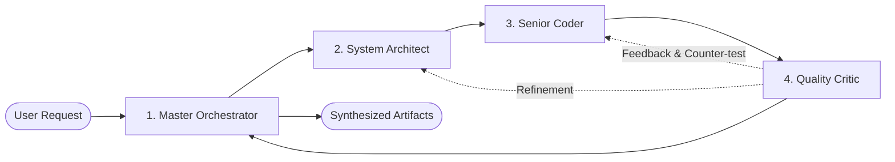

# Agent Pool & Built-In Roles

The MADO: Multi-Agent Debate & Orchestration Platform coordinates multiple specialized autonomous agents that debate, collaborate, and synthesize solutions. Agent definitions, runtime metadata, and UI appearance are managed by [app/agents/base.py](file:///d:/MultiAgentOrchestrator/app/agents/base.py) and [app/agents/pool.py](file:///d:/MultiAgentOrchestrator/app/agents/pool.py).

---

## 1. Agent Architecture & UI Styling

Each agent is represented by the [`Agent`](file:///d:/MultiAgentOrchestrator/app/agents/base.py#L17-L64) Pydantic model. When loaded from [conf.toml](file:///d:/MultiAgentOrchestrator/conf.toml), UI styling attributes (avatar icon, Quasar color, and hex badge color) are assigned automatically:

```python
AGENT_STYLE_MAP = {
    "orchestrator": {"avatar": "forum",        "color": "indigo-8",      "badge_color": "#3f51b5"},
    "architect":    {"avatar": "account_tree", "color": "teal-8",        "badge_color": "#009688"},
    "coder":        {"avatar": "code",         "color": "deep-purple-8", "badge_color": "#673ab7"},
    "critic":       {"avatar": "security",     "color": "amber-9",       "badge_color": "#ff8f00"},
    "user":         {"avatar": "chat_bubble",  "color": "blue-grey-8",   "badge_color": "#607d8b"},
}
```

Agents created from the UI are not in this table.
[`style_for_agent()`](file:///d:/MultiAgentOrchestrator/app/agents/base.py) picks a colour for them
from `CUSTOM_STYLE_PALETTE` using `crc32(key)` — Python's string `hash()` is randomised per process
and would give the same agent a different colour on every restart. Falling back to one grey robot for
everyone made speakers indistinguishable in the debate feed.

---

## 1.1. Debate Placement Fields

Two fields decide where an agent stands in a round. They live on the agent rather than in strategy
code, because strategies used to match on agent keys and every UI-created agent fell through those
tests.

| Field | Default | Meaning |
| :--- | :--- | :--- |
| `debate_priority` | `100` | Speaking order within a round; lower speaks first. Equal values keep `conf.toml` order, so an unconfigured file speaks in file order. |
| `debate_stance` | `"neutral"` | `proponent` / `critic` / `neutral`; read only by the adversarial strategy. |

Both are edited from the roster (drag to reorder, ⋮ menu for stance — see
[roster-editing.md](roster-editing.md)) and both are captured in the session snapshot.

---

## 2. Built-In Agent Roles



### 2.1. Master Orchestrator (`orchestrator`)
- **Key**: `orchestrator` *(Required)*
- **Role**: Moderator, Turn Scheduler & Artifact Synthesizer
- **Allowed MCP Tools**: `filesystem`, `memory`
- **Default Temperature**: `0.2` (Low variance, high precision)
- **Responsibilities**:
  - Analyzes the user's initial objective in Phase 1 and decomposes it into clear discussion topics and guidelines.
  - Controls speaker turns during the debate.
  - Synthesizes the final consensus in Phase 3 into structured artifacts: Markdown comprehensive report, Mermaid diagrams, clean code files, and JSON summaries.

### 2.2. System Architect (`architect`)
- **Key**: `architect`
- **Role**: High-Level Architecture, Tech Stack & Design Patterns
- **Allowed MCP Tools**: `filesystem`, `memory`, `fetch`
- **Default Temperature**: `0.5`
- **Responsibilities**:
  - Formulates system structure, module boundaries, database schemas, and protocols.
  - Drafts architecture flowcharts and sequence diagrams in valid Mermaid syntax.
  - Evaluates third-party libraries and tech stack trade-offs.

### 2.3. Senior Python Engineer (`coder`)
- **Key**: `coder`
- **Role**: Implementation, Refinement & Project Skeleton
- **Allowed MCP Tools**: `filesystem`, `sandbox`, `git`
- **Default Temperature**: `0.1` (Deterministic, bug-free code)
- **Responsibilities**:
  - Implements production-grade, typed Python code adhering to clean architecture.
  - Creates workspace directories and files via the `filesystem` tool.
  - Executes code in the `sandbox` to verify syntax, execution behavior, and test outcomes before submitting.
  - Commits functional checkpoints to the local repository via the `git` tool.

### 2.4. Security & Quality Critic (`critic`)
- **Key**: `critic`
- **Role**: Code Review, Edge Case Analysis & Security Audit
- **Allowed MCP Tools**: `filesystem`, `sandbox`, `git`, `memory`
- **Default Temperature**: `0.3`
- **Responsibilities**:
  - Identifies vulnerabilities (OWASP Top 10, path traversal, injection, unhandled race conditions).
  - Actively writes stress-test and edge-case code, running it in the `sandbox` to substantiate critiques with empirical evidence.
  - Challenges optimistic assumptions made by the Architect or Coder.

---

## 3. The `AgentPool` Registry ([app/agents/pool.py](file:///d:/MultiAgentOrchestrator/app/agents/pool.py))

The [`AgentPool`](file:///d:/MultiAgentOrchestrator/app/agents/pool.py#L9-L56) acts as the runtime registry for all configured agents:

```python
class AgentPool:
    def get(self, key: str) -> Optional[Agent]: ...
    def get_orchestrator(self) -> Agent: ...
    def list_all(self) -> List[Agent]: ...
    def get_active(self, keys: List[str]) -> List[Agent]: ...
```

### Invariants:
1. **Guaranteed Orchestrator**: Calling `pool.get_orchestrator()` raises `RuntimeError` if the orchestrator is missing from `conf.toml`.
2. **Orchestrator Prioritization**: `get_active(keys)` guarantees that the Master Orchestrator is always present and placed at the head of the active roster (`keys = ["orchestrator"] + ...`).

---

## 4. Extending with Custom Specialist Agents

To add a new specialist (e.g. a Data Scientist or DevOps Engineer), append a new block to [conf.toml](file:///d:/MultiAgentOrchestrator/conf.toml):

```toml
[agents.data_scientist]
name = "Lead Data Scientist"
role = "Data Pipeline & ML Architecture"
model = "openai/gpt-4o"
temperature = 0.2
allowed_mcp_servers = ["filesystem", "sandbox"]
system_prompt = """You specialize in data engineering, ETL pipelines, and machine learning models.
Ensure efficient DataFrame operations and validate data validation schemas."""

[agents.data_scientist.sequential_thinking]
enabled = true
max_steps = 6
```

Upon restart (or `pool.reload()`), the new agent is automatically registered, displayed in the web UI roster, and capable of participating in multi-agent debates.
