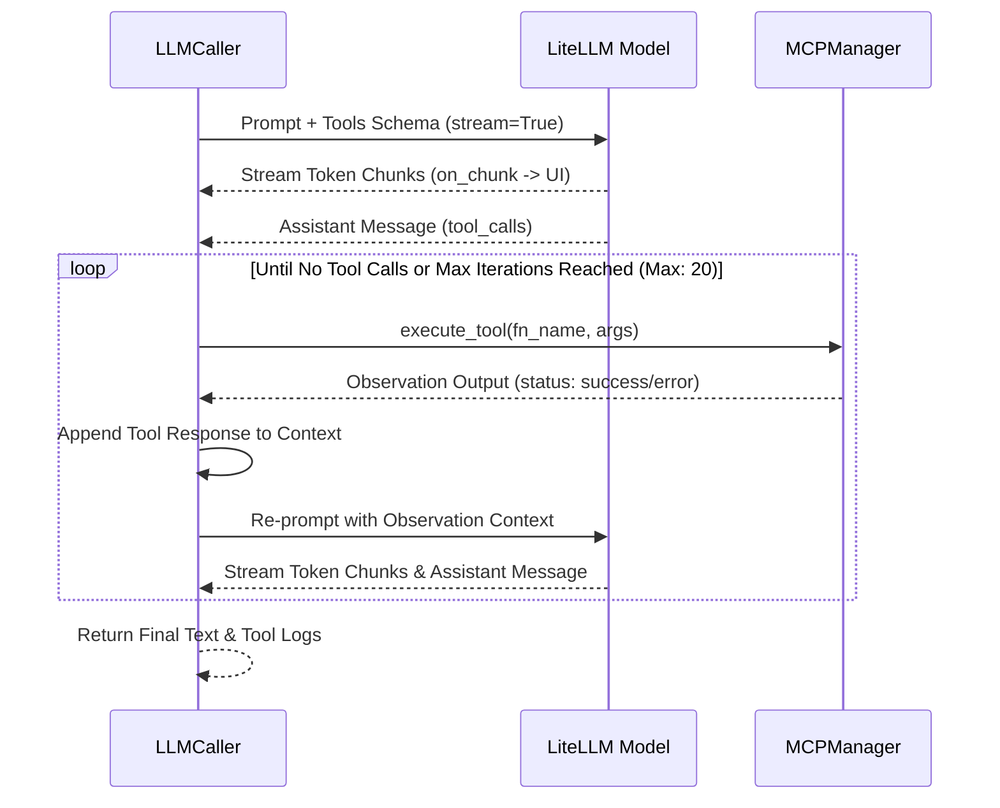

# LLM Integration & LiteLLM Gateway

The Multi-Agent Orchestrator Platform integrates with Large Language Models via [LiteLLM](https://github.com/BerriAI/litellm), managed by the [`LLMCaller`](file:///d:/MultiAgentOrchestrator/app/agents/llm.py#L28-L362) class in [app/agents/llm.py](file:///d:/MultiAgentOrchestrator/app/agents/llm.py).

---

## 1. Unified Multi-Provider Abstraction

LiteLLM abstracts differences between provider APIs (OpenAI, Anthropic, Google Gemini, Azure OpenAI, AWS Bedrock, Vertex AI, Ollama, and self-hosted vLLM / LM Studio instances).

```mermaid
flowchart LR
    Agent[Specialist Agent Turn] --> LLMCaller[LLMCaller (llm.py)]
    LLMCaller --> ToolCheck{is_live?}
    
    ToolCheck -- Yes --> LiteLLM[LiteLLM Gateway]
    ToolCheck -- No / Fallback --> Sim[Intelligent Offline Simulator]
    
    LiteLLM --> Cloud[Cloud: OpenAI / Anthropic / Gemini / Azure]
    LiteLLM --> Local[Local: Ollama / vLLM / LM Studio]
    LiteLLM --> Gateway[Corporate LLM Gateway / Proxy]
```

### Parameter Mapping ([app/agents/llm.py](file:///d:/MultiAgentOrchestrator/app/agents/llm.py#L123-L183))
[`build_completion_kwargs()`](file:///d:/MultiAgentOrchestrator/app/agents/llm.py#L123-L183) translates agent settings into LiteLLM parameters:
- `model`: e.g. `"openai/gpt-4o"`, `"anthropic/claude-3-5-sonnet-20241022"`, `"ollama_chat/qwen2.5-coder:14b"`.
- `api_base`: Base endpoint URL.
- `api_key`: API token. For keyless local endpoints (Ollama, vLLM, LM Studio) that expect a non-empty string, a dummy token (`sk-no-key-required`) is provided automatically.
- `drop_params = True`: Automatically filters out unsupported flags when communicating with local models that do not accept standard OpenAI parameters.
- `timeout` and `num_retries`: Ensures network resilience.
- `extra_headers` and `extra_body`: Injects organization IDs, telemetry tags, or custom headers for corporate proxies.

---

## 2. The Multi-Turn Tool Calling Loop & Real-Time Streaming

When an agent has access to MCP tools, [`_run_litellm_loop()`](file:///d:/MultiAgentOrchestrator/app/agents/llm.py#L199-L270) runs an autonomous observation-thought loop up to `max_tool_iterations` (default: 20):



### Key Behaviors:
1. **Observation Feedback**: The tool output is appended to the message context with `role: "tool"`. The LLM observes the real output (or error message) and refines its reasoning in the next iteration.
2. **Incremental Token Streaming**: Using `acompletion(stream=True)` and `litellm.stream_chunk_builder`, partial word tokens are streamed to `on_chunk`, dynamically rendering in the UI while tools are accumulating.
3. **Tool Execution Streaming**: As each tool executes, the `on_tool_call` asynchronous callback dispatches events to the UI, rendering an accordion widget in the chat feed before the agent's text response finishes generating.

---

## 3. Sequential Thinking (Step-by-Step Reasoning)

Sequential Thinking enforces deliberate reasoning before answering. Configured in `[llm.sequential_thinking]` or `[agents.<key>.sequential_thinking]`, it supports three operational modes:

| Mode | Mechanism | Target Models |
| :--- | :--- | :--- |
| `prompt` | Injects a structured `[Sequential Thinking Protocol]` into the system prompt requiring `Thought 1..N` steps before final conclusions. | All models, including local LLMs. |
| `native` | Passes provider-native reasoning parameters (`reasoning_effort` for OpenAI o1/o3, or `thinking: {budget_tokens: N}` for Anthropic Claude 3.7 Sonnet). | Reasoning-capable cloud models. |
| `mcp` | Forces the agent to call the `sequentialthinking` tool on `@modelcontextprotocol/server-sequential-thinking`. | Models equipped with MCP tool access. |

### Hiding Reasoning Traces (`show_steps = false`)
When `show_steps = false`, [`_apply_show_steps()`](file:///d:/MultiAgentOrchestrator/app/agents/llm.py#L112-L121) strips intermediate thought steps, displaying only content following `## 최종 결론` or `## Final Conclusion`.

---

## 4. Unreachable Endpoints Fail Loudly

There is no offline simulator. When an agent cannot reach its endpoint,
[`call_agent()`](file:///d:/MultiAgentOrchestrator/app/agents/llm.py) raises
`LLMUnavailableError` carrying the model, endpoint label, and the underlying error.

The engine catches it per speaker and records a message with `msg_type="error"` that
states plainly that the turn produced no response. Those messages are shown in the
timeline in a distinct colour, are excluded from every later agent's context and from
the synthesis transcript, and are listed by key in `DebateState.failed_agent_keys`.

This replaced a built-in simulator that invented persona-shaped answers on failure.
A 500 from the endpoint used to look like a successful debate, and the invented turn
then fed the next agent's prompt and the final synthesis report. Whatever partial text
arrived before the connection dropped is kept above the failure notice.


---

## 5. Shaping the Request Before It Goes Out

`call_agent()` runs two transforms on the message list, in this order, before the tool loop.

### 5.1. Trim to the context window (`fit_context_window`)

A debate transcript grows every round, and `max_context_window` was declared in `conf.toml`
and read nowhere. Past a few rounds the request exceeded the model's window and the endpoint
answered **400** (`maximum context length ... however you requested ...`).

The system prompt, the goal, and the current turn instruction are kept; the middle is dropped
oldest-first until the estimate fits `max_context_window - max_tokens - 512`. The model is told
how many turns were elided so it does not invent them. Token counting uses
`litellm.token_counter`, falling back to a character heuristic for unknown models.

The synthesis call is bounded separately, in
[`_build_synthesis_prompt()`](file:///d:/MultiAgentOrchestrator/app/orchestration/engine.py):
it packs the whole transcript into a *single* user message, so there are no messages for
`fit_context_window()` to drop. It fills from the most recent turn backwards — later turns
already reflect the earlier discussion, so if something must go, the front should go.

### 5.2. Merge consecutive same-role turns (`merge_consecutive_roles`)

A debate is a multi-party conversation, but the OpenAI message format has no role for
"a different agent". Every other speaker's turn becomes `user` and only the agent's own
becomes `assistant`, so three specialists produce three to five consecutive `user` messages,
growing with the round count.

OpenAI accepts that. **Anthropic, Gemini, and several OpenAI-compatible shims (llama.cpp
server, some vLLM chat templates) reject it with 400** — `roles must alternate between user
and assistant`. On such an endpoint the orchestrator's planning call succeeds (it is a single
user message) while *every specialist turn fails*, which reads as "the agents keep losing
their connection".

Consecutive `user` or `assistant` messages are merged into one, joined by a blank line. Each
turn already carries a `[Name (Role)]:` header, so who said what survives the merge. Messages
carrying `tool_calls`, and `tool` results, are never merged — that would break the
`tool_call_id` pairing.

Order matters: trim first, merge second. Trimming inserts its elision notice as a `user`
message, which would otherwise sit next to another `user` message.
