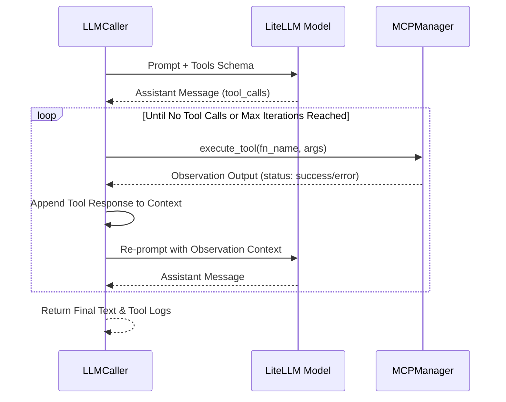

# LLM Integration & LiteLLM Gateway

The Multi-Agent Orchestrator Platform integrates with Large Language Models via [LiteLLM](https://github.com/BerriAI/litellm), managed by the [`LLMCaller`](file:///d:/MultiAgentOrchestrator/app/agents/llm.py#L28-L362) class in [app/agents/llm.py](file:///d:/MultiAgentOrchestrator/app/agents/llm.py).

---

## 1. Unified Multi-Provider Abstraction

LiteLLM abstracts differences between provider APIs (OpenAI, Anthropic, Google Gemini, Azure OpenAI, AWS Bedrock, Vertex AI, Ollama, and self-hosted vLLM / LM Studio instances).

```mermaid
flowchart LR
    Agent[Specialist Agent Turn] --> LLMCaller[LLMCaller (llm.py)]
    LLMCaller --> ToolCheck{is_live?}
    
    ToolCheck -- Yes --> LiteLLM[LiteLLM Gateway]
    ToolCheck -- No / Fallback --> Sim[Intelligent Offline Simulator]
    
    LiteLLM --> Cloud[Cloud: OpenAI / Anthropic / Gemini / Azure]
    LiteLLM --> Local[Local: Ollama / vLLM / LM Studio]
    LiteLLM --> Gateway[Corporate LLM Gateway / Proxy]
```

### Parameter Mapping ([app/agents/llm.py](file:///d:/MultiAgentOrchestrator/app/agents/llm.py#L123-L183))
[`build_completion_kwargs()`](file:///d:/MultiAgentOrchestrator/app/agents/llm.py#L123-L183) translates agent settings into LiteLLM parameters:
- `model`: e.g. `"openai/gpt-4o"`, `"anthropic/claude-3-5-sonnet-20241022"`, `"ollama_chat/qwen2.5-coder:14b"`.
- `api_base`: Base endpoint URL.
- `api_key`: API token. For keyless local endpoints (Ollama, vLLM, LM Studio) that expect a non-empty string, a dummy token (`sk-no-key-required`) is provided automatically.
- `drop_params = True`: Automatically filters out unsupported flags when communicating with local models that do not accept standard OpenAI parameters.
- `timeout` and `num_retries`: Ensures network resilience.
- `extra_headers` and `extra_body`: Injects organization IDs, telemetry tags, or custom headers for corporate proxies.

---

## 2. The Multi-Turn Tool Calling Loop

When an agent has access to MCP tools, [`_run_litellm_loop()`](file:///d:/MultiAgentOrchestrator/app/agents/llm.py#L199-L270) runs an autonomous observation-thought loop up to `max_tool_iterations` (default: 5):



### Key Behaviors:
1. **Observation Feedback**: The tool output is appended to the message context with `role: "tool"`. The LLM observes the real output (or error message) and refines its reasoning in the next iteration.
2. **Real-Time Streaming**: As each tool executes, the `on_tool_call` asynchronous callback dispatches events to the UI, rendering an accordion widget in the chat feed before the agent's text response finishes generating.

---

## 3. Sequential Thinking (Step-by-Step Reasoning)

Sequential Thinking enforces deliberate reasoning before answering. Configured in `[llm.sequential_thinking]` or `[agents.<key>.sequential_thinking]`, it supports three operational modes:

| Mode | Mechanism | Target Models |
| :--- | :--- | :--- |
| `prompt` | Injects a structured `[Sequential Thinking Protocol]` into the system prompt requiring `Thought 1..N` steps before final conclusions. | All models, including local LLMs. |
| `native` | Passes provider-native reasoning parameters (`reasoning_effort` for OpenAI o1/o3, or `thinking: {budget_tokens: N}` for Anthropic Claude 3.7 Sonnet). | Reasoning-capable cloud models. |
| `mcp` | Forces the agent to call the `sequentialthinking` tool on `@modelcontextprotocol/server-sequential-thinking`. | Models equipped with MCP tool access. |

### Hiding Reasoning Traces (`show_steps = false`)
When `show_steps = false`, [`_apply_show_steps()`](file:///d:/MultiAgentOrchestrator/app/agents/llm.py#L112-L121) strips intermediate thought steps, displaying only content following `## 최종 결론` or `## Final Conclusion`.

---

## 4. Offline Fallback Simulator

When credentials are omitted, or when an external API call fails and `fallback_to_simulation = true`, [`_run_simulated_turn()`](file:///d:/MultiAgentOrchestrator/app/agents/llm.py#L272-L362) simulates realistic multi-agent debate turns:

- **Role-Aware Content**: Generates contextually relevant text for each role (Architect drafts architecture & schemas; Coder writes Python implementations; Critic analyzes edge cases and OWASP flaws; Orchestrator generates synthesis reports).
- **Simulated Tool Invocations**: Invokes real or mock filesystem operations and sandbox syntax verifications so that the full UI timeline and artifact viewers are exercised in isolated environments.
