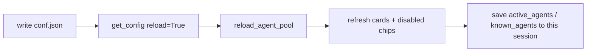

# Roster Editing — Changing `conf.json` From the UI

Agents used to exist only in [conf.json](file:///d:/MultiAgentOrchestrator/conf.json). Adding one, giving
it a different place in the round, or removing it meant opening the file in an editor and restarting
the app. The roster panel now performs all of it in place, writing through to `conf.json` so the
change survives the next boot.

Five operations share one surface and **one lock**:

| Operation | Control | Value written |
| :--- | :--- | :--- |
| Add an agent | **에이전트 추가** button in the roster header | a new `agents.<key>` section |
| Speaking order | **drag a card** | `debate_priority` |
| Debate stance | the card's **⋮ menu** | `debate_stance` |
| Disable / delete | the card's **⋮ menu** | `enabled` / section removal |
| Tool assignment | the card's **도구 N** button | `allowed_mcp_servers` |

---

## 1. The lock: who may edit, and when

All five are gated by
[`_agent_admin_lock_reason()`](file:///d:/MultiAgentOrchestrator/app/ui/components/roster.py). Opening
only some of them would produce the worst outcome — a user changes something and cannot tell why the
conversation ignored it.

| State | Editing |
| :--- | :--- |
| This conversation has not started, and no debate is running anywhere | 🟢 all five allowed |
| This conversation already has a first message | 🔒 locked — its agent configuration is frozen |
| Any conversation is mid-debate | 🔒 locked — the agent pool is process-wide |

The second row is the interesting one. A started conversation freezes its whole agent configuration
into `session_agents.config_snapshot` (see
[session-personas.md](session-personas.md#6-a-started-conversation-is-self-contained)), so edits made
here genuinely cannot reach it. The lock message therefore names every operation it blocks, not just
"add and delete".

The third row exists because `AgentPool` is a single process-wide registry. Reloading it mid-debate
would change the speaker list of a turn already in flight.

---

## 2. Writing to `conf.json` without destroying it

Half of `conf.json` is prose — notes explaining what each server does and why something is switched
off. JSON has no comment syntax, so those notes live as **keys beginning with `//`**, which
[`strip_comment_keys()`](file:///d:/MultiAgentOrchestrator/app/config.py) removes before validation.
They are ordinary data, which is what makes the writers simple. Every writer in
[app/config.py](file:///d:/MultiAgentOrchestrator/app/config.py) is the same four steps:

1. **Validate the input first.** Agent keys and server names must match `BARE_KEY_PATTERN`, stances
   must be one of `DEBATE_STANCES`, and unknown override fields are rejected. Nothing has been
   written yet, so a bad request cannot leave a half-edited file behind.
2. **Read the raw file** with [`read_conf_file()`](file:///d:/MultiAgentOrchestrator/app/config.py) —
   `//` notes included, `${VAR}` placeholders unresolved. The screen shows *resolved* values; echoing
   those back would bake another machine's absolute paths and a plaintext API key into the file.
3. **Edit the parsed dictionary.** Assigning to an existing key keeps its position; a new key is
   appended inside its own object, so a new agent lands among the agents and a new server among the
   servers, with no insertion-point arithmetic.
4. **Rewrite it once** with [`write_conf_file()`](file:///d:/MultiAgentOrchestrator/app/config.py),
   which writes to a temporary file and `os.replace()`s it into place. A crash mid-write cannot leave
   a truncated config — that state stops the app from booting at all.

Deleting an agent or server leaves the `//` note above it. Deleting prose a human wrote cannot be
undone, and it is exactly what you want back when you re-add the agent.

Adding then deleting an agent restores the file **byte for byte**; that round-trip is asserted in
[tests/test_agent_admin.py](file:///d:/MultiAgentOrchestrator/tests/test_agent_admin.py).

> This used to be considerably harder. TOML has a standard-library reader but no writer, so the
> writers edited **line ranges** — tracking multi-line string state so a `system_prompt` containing
> a `[검토 항목]` line was not mistaken for a section header, and excluding trailing comments that
> belonged to the *next* section. Moving to JSON deleted that machinery outright.

---

## 3. Adding an agent: prefilled, but not written back

The add dialog prefills every LLM field — model, API URL, API key, provider, temperature, context
window, response tokens, timeout, retries, tool-loop limit — from
[`agent_defaults_from_llm()`](file:///d:/MultiAgentOrchestrator/app/config.py), which resolves the
effective default (the `llm` value if set, otherwise the `AgentConfig` default).

**Fields left untouched are not written to the file.**
[`prune_agent_overrides()`](file:///d:/MultiAgentOrchestrator/app/config.py) drops anything equal to
the prefilled default, and only the remainder lands in the section:

```json
"data_analyst": {
  "name": "Data Analyst",
  "role": "Data & Metrics Analysis",
  "temperature": 0.15,
  "allowed_mcp_servers": ["filesystem", "git"],
  "system_prompt": "..."
}
```

`temperature` is the only LLM field the user changed; everything else is absent and therefore
inherited.

Two reasons this matters:

1. **Secrets.** What the browser displays is the *resolved* value. Echoing it back would write a
   plaintext API key into `conf.json` — the same file the MCP-server writers work hard to keep free
   of resolved `${VAR}` values.
2. **Inheritance.** Fields that are absent keep inheriting `llm`, so changing `.env` moves this
   agent along with everyone else.

The same dialog sets the persona (`system_prompt`), MCP tool assignment, sequential-thinking mode,
and debate stance.

---

## 4. Disable versus delete

Both remove the agent from the pool — `AgentPool.reload()` skips `"enabled": false` — but they differ
in what is recoverable.

| | Disable | Delete |
| :--- | :--- | :--- |
| `conf.json` | `"enabled": false` added | the whole agent object removed |
| Recoverable from the UI | yes, via the **꺼둔 에이전트** chips | no |
| Effect on started conversations | none | none |

A disabled agent is invisible in the pool, so the roster renders it separately as a chip row.
Without that, switching one off would be a one-way door through the UI.

Neither operation touches conversations that have already started — their configuration is frozen.
The orchestrator can be neither disabled nor deleted; it runs planning and synthesis, and
`RootConfig` refuses to validate without it.

---

## 5. Speaking order by drag

Card order **is** speaking order. Dropping a card rewrites `debate_priority` as `10, 20, 30, …`
([`set_agent_debate_order_in_conf_file()`](file:///d:/MultiAgentOrchestrator/app/config.py)); the gaps
leave room to insert one agent between two others later without rewriting the rest.

### 5.1. The drop position must follow the cursor

The first implementation always inserted **before** the target. Two things were then impossible:

- **Moving one step right.** Removing the card first pulls the neighbour back into the vacated slot,
  so re-inserting before it is a no-op. `[A, C, R]` dragging `A` onto `C` yields `[A, C, R]` — the
  card visibly snaps back and the feature reads as broken.
- **Reaching the last position.** "Before the last card" is as far right as you can get.

The drop handler now takes the cursor's half: left half inserts before, right half inserts after.
[tests/test_agent_admin.py](file:///d:/MultiAgentOrchestrator/tests/test_agent_admin.py) pins both the
new behaviour and the fact that the old rule was a no-op, and asserts that one drag can place any
card in any position.

> Reversing three cards still takes two drags. That is a property of moving one element at a time,
> not a limitation of the drag.

### 5.2. The drag runs in the browser

`dragover` fires continuously — dozens of times per second — while the cursor is over a card.
NiceGUI emits an event to the server whenever a Python handler is registered, so the original
`card.on("dragover.prevent", lambda _: None)` flooded the websocket for the whole duration of a drag.

Passing only `js_handler` handles the event client-side and emits nothing
([`JS_DRAG_OVER`](file:///d:/MultiAgentOrchestrator/app/ui/components/roster.py)). Exactly three
messages now cross the wire per drag: `dragstart`, `drop`, `dragend`.

The same JS handlers provide the feedback that makes the interaction legible: the lifted card fades
(`.agent-dragging`), and the target card grows a thick bar on the edge the card will land on
(`.agent-drop-before` / `.agent-drop-after`, defined in
[app/ui/theme.py](file:///d:/MultiAgentOrchestrator/app/ui/theme.py)). `box-shadow: inset` draws the
bar without affecting layout, so cards do not jump as the indicator moves.

The orchestrator card is neither draggable nor a drop target — it stands outside the rounds.

---

## 6. Debate stance

`debate_stance` (`proponent` / `critic` / `neutral`) is read only by the adversarial strategy, which
alternates the two sides. It replaced a hardcoded `["architect", "coder"]` versus `"critic"` test that
broke the moment agents could be created from the UI. See
[debate-strategies.md](../orchestration/debate-strategies.md#22-adversarial-debate-adversarial_debate).

The shipped `conf.json` and `conf.example.json` declare stances for the four built-in agents. Without
them every agent is `neutral`, the adversarial strategy finds no opposing side, and it quietly
degrades to a single priority-ordered pass.

---

## 7. Applying the change to the running app

Writing the file is not enough — the screen and the live pool would drift until the next restart.
[`_apply_agent_change()`](file:///d:/MultiAgentOrchestrator/app/ui/components/roster.py) chains:



MCP servers are **not** restarted — none of these five operations changes a server's command line,
and restarting them costs seconds for nothing. A broken `conf.json` leaves the running configuration
untouched: `get_config()` swaps the global only after a successful parse.

The **conf.json 다시 읽기** button reaches the same end state for edits made in an external editor.
