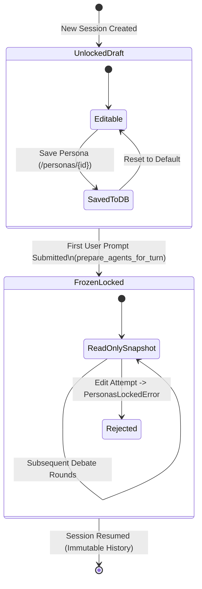

# Session Personas & Immutability Lifecycle

In the Multi-Agent Orchestrator Platform, `conf.toml` defines system-wide default agent configurations. However, different collaboration scenarios (e.g. cloud migration vs. embedded systems) require tailored system prompts and agent titles.

The session persona management system, implemented in [app/agents/personas.py](file:///d:/MultiAgentOrchestrator/app/agents/personas.py), provides session-specific persona overrides while guaranteeing **persona immutability** once a debate begins.

---

## 1. Why Persona Immutability is Essential

If an agent's persona, role, or instructions change mid-conversation:
- Later arguments directly contradict earlier statements made by the same speaker.
- The Master Orchestrator cannot reliably trace consensus or accountability.
- Re-opening old sessions fails if the global `conf.toml` has since been updated.

Therefore, the platform enforces a strict **three-phase lifecycle**:



---

## 2. The 3-Phase Lifecycle

### Phase 1: Unlocked Draft (Session Creation)
- When a new session is created, `session.personas_locked` is `False`.
- The user can open the persona editor at `/personas/{session_id}` (accessed via the **"Persona Settings"** button in the agent roster panel).
- **Editable Fields**: `name`, `role`, and `system_prompt`.
- Operational settings (`model`, `api_base`, `allowed_mcp_servers`, and credentials) remain governed by `conf.toml` for operational stability.
- Draft changes are saved to the [`session_agents`](file:///d:/MultiAgentOrchestrator/app/database/models.py#L94-L115) table in SQLite.
- Agents that have not been edited continue to reflect their `conf.toml` defaults.

### Phase 2: Freeze & Lock (First User Message)
- When the user sends their first message, [prepare_agents_for_turn()](file:///d:/MultiAgentOrchestrator/app/agents/personas.py#L217-L229) triggers [`freeze_personas()`](file:///d:/MultiAgentOrchestrator/app/agents/personas.py#L163-L195).
- The system resolves the effective persona for **every** agent in the pool. For any agent lacking an explicit draft in `session_agents`, a snapshot of its current `conf.toml` configuration is written to the database.
- `session.personas_locked` is set to `True`.
- Any subsequent attempt to call `save_persona()` or `reset_persona()` raises [`PersonasLockedError`](file:///d:/MultiAgentOrchestrator/app/agents/personas.py#L36-L44).
- The UI transitions the editor into a locked read-only state.

### Phase 3: Session Resumption (Historical Fidelity)
- When a user resumes an existing session days or weeks later, [`effective_personas()`](file:///d:/MultiAgentOrchestrator/app/agents/personas.py#L95-L110) loads the frozen snapshot from SQLite.
- Even if `conf.toml` has been modified or updated in the interim, the session continues executing with the exact personas that created the historical debate transcript.

---

## 3. Difference Detection (`is_customized`)

The UI displays an orange **"Customized"** badge for any agent whose persona differs from the server default.

### Detection Mechanism:
Because `freeze_personas()` snapshots all agents into `session_agents` upon the first message, the mere existence of a database row cannot determine if a user deliberately customized the agent.

Instead, [`_differs()`](file:///d:/MultiAgentOrchestrator/app/agents/personas.py#L59-L62) performs field-by-field value comparison:

```python
EDITABLE_FIELDS = ("name", "role", "system_prompt")

def _differs(a: AgentPersona, b: AgentPersona) -> bool:
    return any(getattr(a, f) != getattr(b, f) for f in EDITABLE_FIELDS)
```

If `name`, `role`, or `system_prompt` differs from the `conf.toml` baseline, `is_customized` is set to `True`.

---

## 4. Persona REST API

Clients can query session persona statuses programmatically:

### `GET /api/sessions/{session_id}/personas`

**Response Example**:
```json
{
  "session_id": "7b8e5c84-18be-4cb9-9943-85b42d768134",
  "personas_locked": true,
  "agents": [
    {
      "agent_key": "architect",
      "name": "Cloud Native Architect",
      "role": "Microservices & Kubernetes Specialist",
      "system_prompt": "Focus exclusively on distributed systems and container orchestration.",
      "is_customized": true
    },
    {
      "agent_key": "coder",
      "name": "Senior Python Engineer",
      "role": "Implementation & Code Refinement",
      "system_prompt": "Standard clean code implementation...",
      "is_customized": false
    }
  ]
}
```

---

## 5. Global Persona Configuration Sync (`conf.toml` Persistence)

Starting from the latest enhancement, editing an agent's persona on the Web UI (`/personas/{session_id}`) not only updates the draft persona in SQLite for the session, but also persists the updated baseline directly into `conf.toml`:

### Workflow
1. **Targeted TOML Modification**:
   [`update_agent_persona_in_conf_file()`](file:///d:/MultiAgentOrchestrator/app/config.py) parses the existing `conf.toml` file, preserving existing formatting, multiline prompts, and comments. It locates `[agents.<agent_key>]` and updates `name`, `role`, and `system_prompt`.
2. **In-Memory Pool Reloading**:
   After writing to disk, `get_config(reload=True)` re-reads the configuration, and `get_agent_pool().reload()` refreshes all in-memory `Agent` instances.
3. **Reactive UI Synchronization**:
   The main debate page's [`AgentRosterControl`](file:///d:/MultiAgentOrchestrator/app/ui/components/roster.py) dynamically updates its roster cards via `update_agents()`, ensuring that modified agent names and roles appear immediately without requiring a full browser refresh.

