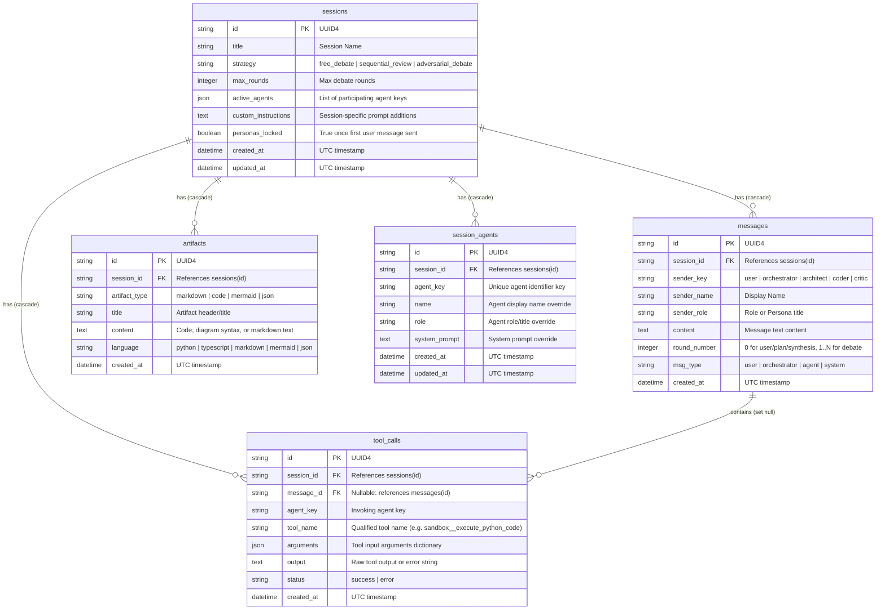

# Database Schema & Persistence

The MADO: Multi-Agent Debate & Orchestration Platform uses SQLite with the asynchronous **SQLAlchemy 2.0 ORM** powered by `aiosqlite`. All database models are defined in [app/database/models.py](file:///d:/MultiAgentOrchestrator/app/database/models.py), and connection pooling and engine management are handled in [app/database/session.py](file:///d:/MultiAgentOrchestrator/app/database/session.py).

---

## 1. Entity-Relationship Diagram (ERD)



---

## 2. Table Specifications

### 2.1. `sessions` Table ([SessionModel](file:///d:/MultiAgentOrchestrator/app/database/models.py#L16-L42))
Represents a single multi-agent collaboration workspace or discussion thread.

| Column | Type | Nullable | Default | Description |
| :--- | :--- | :--- | :--- | :--- |
| `id` | `VARCHAR(36)` | No | `uuid4()` | Primary key. |
| `title` | `VARCHAR(255)` | No | `'New Debate Session'` | Session title displayed in the sidebar. Defaults to first prompt snippet. |
| `strategy` | `VARCHAR(50)` | No | `'free_debate'` | Selected debate strategy (`free_debate`, `sequential_review`, `adversarial_debate`). |
| `max_rounds` | `INTEGER` | No | `3` | Maximum specialist debate rounds per user turn. |
| `active_agents` | `JSON` | No | `[]` | Array of agent keys participating in this session. |
| `custom_instructions` | `TEXT` | No | `''` | User-defined custom instructions injected into every agent prompt. |
| `personas_locked` | `BOOLEAN` | No | `False` | Locks session personas once the first user message is received. |
| `created_at` | `DATETIME` | No | `utc_now` | UTC creation timestamp. |
| `updated_at` | `DATETIME` | No | `utc_now` | UTC last updated timestamp. |

### 2.2. `messages` Table ([MessageModel](file:///d:/MultiAgentOrchestrator/app/database/models.py#L44-L61))
Stores the sequential transcript of messages exchanged during a debate.

| Column | Type | Nullable | Default | Description |
| :--- | :--- | :--- | :--- | :--- |
| `id` | `VARCHAR(36)` | No | `uuid4()` | Primary key. |
| `session_id` | `VARCHAR(36)` | No | - | Foreign key referencing `sessions.id` (ON DELETE CASCADE). |
| `sender_key` | `VARCHAR(50)` | No | - | Identifier key of sender (`user`, `orchestrator`, `architect`, etc.). |
| `sender_name` | `VARCHAR(100)` | No | - | Display name of the sender at the time of message creation. |
| `sender_role` | `VARCHAR(100)` | No | `''` | Role of the sender at the time of message creation. |
| `content` | `TEXT` | No | `''` | Text content of the message. |
| `round_number` | `INTEGER` | No | `0` | Debate round number (`0` for user input, planning, synthesis). |
| `msg_type` | `VARCHAR(30)` | No | `'agent'` | Message classification: `'user'`, `'orchestrator'`, `'agent'`, `'system'`. |
| `created_at` | `DATETIME` | No | `utc_now` | UTC creation timestamp. |

### 2.3. `tool_calls` Table ([ToolCallRecordModel](file:///d:/MultiAgentOrchestrator/app/database/models.py#L63-L78))
Logs every MCP tool invocation executed by an agent during a turn.

| Column | Type | Nullable | Default | Description |
| :--- | :--- | :--- | :--- | :--- |
| `id` | `VARCHAR(36)` | No | `uuid4()` | Primary key. |
| `session_id` | `VARCHAR(36)` | No | - | Foreign key referencing `sessions.id` (ON DELETE CASCADE). |
| `message_id` | `VARCHAR(36)` | Yes | `None` | Optional foreign key referencing `messages.id` (ON DELETE SET NULL). |
| `agent_key` | `VARCHAR(50)` | No | - | Agent key that initiated the tool call. |
| `tool_name` | `VARCHAR(100)` | No | - | Qualified tool name (e.g. `filesystem__write_file`). |
| `arguments` | `JSON` | No | `{}` | JSON dictionary of inputs sent to the tool. |
| `output` | `TEXT` | No | `''` | Raw string result or error output returned by the MCP server. |
| `status` | `VARCHAR(20)` | No | `'success'` | Execution result status (`'success'` or `'error'`). |
| `created_at` | `DATETIME` | No | `utc_now` | UTC execution timestamp. |

### 2.4. `artifacts` Table ([ArtifactModel](file:///d:/MultiAgentOrchestrator/app/database/models.py#L80-L92))
Persists individual output artifacts synthesized by the Master Orchestrator at the end of a debate.

| Column | Type | Nullable | Default | Description |
| :--- | :--- | :--- | :--- | :--- |
| `id` | `VARCHAR(36)` | No | `uuid4()` | Primary key. |
| `session_id` | `VARCHAR(36)` | No | - | Foreign key referencing `sessions.id` (ON DELETE CASCADE). |
| `artifact_type` | `VARCHAR(30)` | No | `'markdown'` | Category: `'code'`, `'markdown'`, `'mermaid'`, or `'json'`. |
| `title` | `VARCHAR(255)` | No | `'Synthesized Artifact'` | Human-readable title for the artifact viewer tab. |
| `content` | `TEXT` | No | `''` | Raw text content of the artifact. |
| `language` | `VARCHAR(50)` | No | `'markdown'` | Syntax highlighting language (e.g. `'python'`, `'mermaid'`). |
| `created_at` | `DATETIME` | No | `utc_now` | UTC creation timestamp. |

### 2.5. `session_agents` Table ([SessionAgentModel](file:///d:/MultiAgentOrchestrator/app/database/models.py#L94-L115))
Stores customized agent persona overrides (name, role, system prompt) for a specific session.

| Column | Type | Nullable | Default | Description |
| :--- | :--- | :--- | :--- | :--- |
| `id` | `VARCHAR(36)` | No | `uuid4()` | Primary key. |
| `session_id` | `VARCHAR(36)` | No | - | Foreign key referencing `sessions.id` (ON DELETE CASCADE). |
| `agent_key` | `VARCHAR(50)` | No | - | Key of the agent (e.g., `'architect'`). |
| `name` | `VARCHAR(100)` | No | `''` | Customized display name. |
| `role` | `VARCHAR(150)` | No | `''` | Customized role description. |
| `system_prompt` | `TEXT` | No | `''` | Customized system prompt. |
| `created_at` | `DATETIME` | No | `utc_now` | UTC creation timestamp. |
| `updated_at` | `DATETIME` | No | `utc_now` | UTC update timestamp. |

> **Unique Constraint**: A compound unique constraint `uq_session_agent` exists across `(session_id, agent_key)`, ensuring only one persona record exists per agent per session.

---

## 3. Session Initialization & Connection Management

The database connection engine is configured in [app/database/session.py](file:///d:/MultiAgentOrchestrator/app/database/session.py):

```python
from sqlalchemy.ext.asyncio import AsyncSession, async_sessionmaker, create_async_engine

# Asynchronous engine with SQLite Write-Ahead Logging (WAL) recommended for concurrency
engine = create_async_engine(
    db_url,
    echo=debug,
    connect_args={"check_same_thread": False},
)
session_factory = async_sessionmaker(bind=engine, class_=AsyncSession, expire_on_commit=False)
```

### Table Auto-Creation
When the application starts up inside `lifespan()` in [app/main.py](file:///d:/MultiAgentOrchestrator/app/main.py#L33-L35), it calls `init_db(db_url)`. This executes:
```python
async with engine.begin() as conn:
    await conn.run_sync(Base.metadata.create_all)
```
This guarantees that all required tables and constraints are created automatically without requiring separate migration tools.
