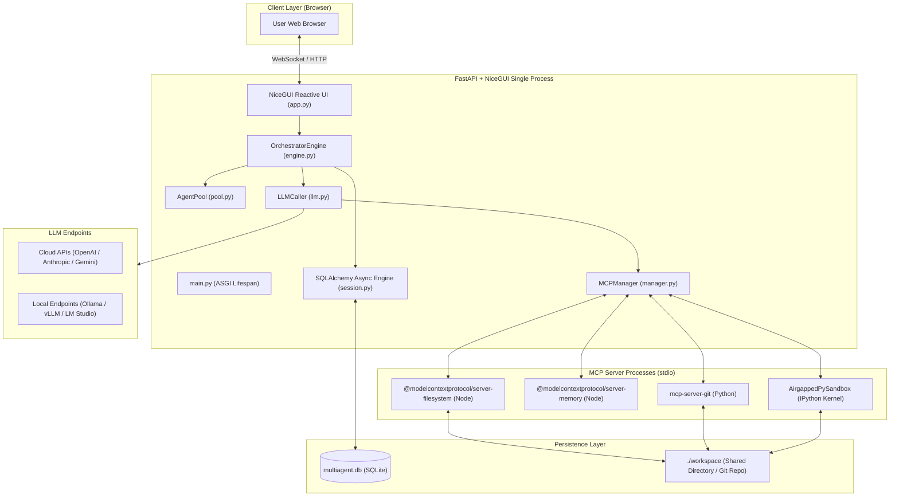
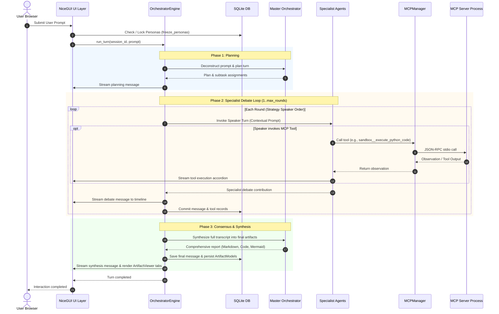

# Architecture Overview

This document describes the high-level architecture, technology stack, component decomposition, and execution flow of the **MADO: Multi-Agent Debate & Orchestration Platform**.

---

## 1. Architectural Philosophy

The MADO: Multi-Agent Debate & Orchestration Platform is designed around five foundational principles:

1. **Python-Native Full-Stack Unification**: The application combines backend logic ([FastAPI](file:///d:/MultiAgentOrchestrator/app/main.py)) and frontend reactive rendering ([NiceGUI](file:///d:/MultiAgentOrchestrator/app/ui/app.py)) in a single Python runtime. This eliminates separate Node.js frontend build steps, transpilation, or split deployments.
2. **Dynamic Declarative Configuration**: Everything from model endpoints and API keys to individual agent personas and MCP tool access permissions is governed by [conf.json](file:///d:/MultiAgentOrchestrator/conf.json). The application never requires code changes to switch models, tune temperatures, or register new agent roles.
3. **Decoupled Tool Protocol (MCP)**: Instead of proprietary tool implementations, the system integrates the open **Model Context Protocol (MCP)**. Tool execution runs in isolated background processes (Node.js or Python) communicating via standard JSON-RPC over `stdio`.
4. **Resilient Multi-Provider LLM Abstraction**: Powered by [LiteLLM](file:///d:/MultiAgentOrchestrator/app/agents/llm.py), agents can utilize OpenAI, Anthropic, Google Gemini, Azure OpenAI, Ollama, LM Studio, or vLLM endpoints interchangeably. In development or offline environments lacking credentials, an embedded intelligent simulator seamlessly takes over.
5. **Stateful Conversation & Persona Immutability**: While agent configurations are globally defined, each session allows independent persona customization. Once debate commences, personas are locked into the database ([SessionAgentModel](file:///d:/MultiAgentOrchestrator/app/database/models.py#L94-L115)) to guarantee consistent reasoning across multiple rounds and later sessions.

---

## 2. Technology Stack

| Layer | Component | Description & Rationale |
| :--- | :--- | :--- |
| **Runtime** | Python 3.11+ | Modern async/await, task groups, and strong typing. |
| **Server & API** | FastAPI + Uvicorn | High-performance asynchronous ASGI web server handling REST endpoints and application lifespan. |
| **Reactive Web UI** | NiceGUI (Vue / Quasar) | Python-based reactive UI engine using WebSocket connections for live message streaming and UI bindings. |
| **LLM Provider Gateway** | LiteLLM | Unified abstraction over 100+ LLM providers, parameter normalization, and function-calling schemas. |
| **Tool Protocol** | MCP Python SDK (`mcp`) | Host/client implementation managing `stdio` JSON-RPC communication with local and external MCP servers. |
| **Database & ORM** | SQLAlchemy (Async) + aiosqlite | Asynchronous SQLite ORM for persisting sessions, messages, tool traces, artifacts, and persona snapshots. |
| **Configuration** | Pydantic v2 + stdlib `json` | Strictly validated data classes with dynamic environment variable resolution (`${VAR:-default}`). A JSON config needs no third-party reader *or* writer, so the UI can safely write settings back. |

---

## 3. High-Level System Architecture

---

## 4. Subsystem Decomposition

### 4.1. Entrypoint & Lifecycle ([app/main.py](file:///d:/MultiAgentOrchestrator/app/main.py))
- Manages application startup and shutdown using `fastapi.concurrency.asynccontextmanager`.
- Initializes the configuration singleton via `get_config()`.
- Runs database table migrations via `init_db()`.
- Launches all enabled MCP servers and builds the tool registry via `MCPManager.initialize()`.
- Instantiates the `AgentPool`.
- Mounts REST API endpoints (`/api/health`, `/api/agents`, `/api/mcp`, `/api/sessions/{session_id}/personas`).
- Serves the NiceGUI application at `http://{host}:{port}`.
- On shutdown, gracefully closes all running MCP subprocesses and releases resources.

### 4.2. Configuration Subsystem ([app/config.py](file:///d:/MultiAgentOrchestrator/app/config.py))
- Parses [conf.json](file:///d:/MultiAgentOrchestrator/conf.json) with the standard-library `json` module, stripping `//` documentation keys.
- Replaces environment variable patterns recursively: `${VAR}`, `${VAR:-default}`, and nested `${VAR:-${FALLBACK:-default}}`.
- Binds global `llm` configurations onto individual agent configurations unless explicitly overridden.
- Validates configs using Pydantic models: `AppConfig`, `LLMConfig`, `MCPServerConfig`, `AgentConfig`, and `SequentialThinkingConfig`.

### 4.3. Persistence Subsystem ([app/database/](file:///d:/MultiAgentOrchestrator/app/database/))
- Defined in [models.py](file:///d:/MultiAgentOrchestrator/app/database/models.py) and [session.py](file:///d:/MultiAgentOrchestrator/app/database/session.py).
- Uses `SQLAlchemy` async declarative base with `aiosqlite`.
- Stores complete conversation history, tool invocation parameters and outputs, extracted artifacts, and locked agent personas.

### 4.4. Agent & LLM Layer ([app/agents/](file:///d:/MultiAgentOrchestrator/app/agents/))
- **Base Agent Model** ([base.py](file:///d:/MultiAgentOrchestrator/app/agents/base.py)): Defines runtime metadata, UI badge colors, icons, and connection modes (live vs. unconfigured).
- **Agent Pool Registry** ([pool.py](file:///d:/MultiAgentOrchestrator/app/agents/pool.py)): Holds active agent instances loaded from configuration.
- **Session Personas** ([personas.py](file:///d:/MultiAgentOrchestrator/app/agents/personas.py)): Coordinates session-specific overrides and the freeze/lock mechanism.
- **LLM Caller** ([llm.py](file:///d:/MultiAgentOrchestrator/app/agents/llm.py)): Wraps LiteLLM `acompletion`, injects system prompts, and manages multi-turn tool loops up to `max_tool_iterations`. An unreachable endpoint raises `LLMUnavailableError`; nothing is fabricated in its place.

### 4.5. Model Context Protocol (MCP) Host ([app/mcp/](file:///d:/MultiAgentOrchestrator/app/mcp/))
- Implements an asynchronous MCP host manager ([manager.py](file:///d:/MultiAgentOrchestrator/app/mcp/manager.py)) and stdio client connection manager ([client.py](file:///d:/MultiAgentOrchestrator/app/mcp/client.py)).
- Manages long-lived client processes so stateful tools (e.g., IPython kernel namespaces, memory graph) persist across debate turns.
- Auto-converts MCP tool schemas into OpenAI Function Calling format with namespaced qualified names (`server__tool`).
- Captures raw process stderr using a dedicated background thread tee for accurate diagnostic tooltips in the UI.

### 4.6. Multi-Agent Orchestration Engine ([app/orchestration/](file:///d:/MultiAgentOrchestrator/app/orchestration/))
- Governed by [engine.py](file:///d:/MultiAgentOrchestrator/app/orchestration/engine.py), [state.py](file:///d:/MultiAgentOrchestrator/app/orchestration/state.py), and [strategies.py](file:///d:/MultiAgentOrchestrator/app/orchestration/strategies.py).
- Coordinates state transitions across three phases:
  1. **Planning Phase**: Master Orchestrator analyzes the user goal and sets expectations.
  2. **Specialist Debate Phase**: Active agents take turns according to the selected strategy (`sequential_debate`, `adversarial_debate`, or `orchestrator_led`), invoking MCP tools as needed. Order comes from each agent's `debate_priority`; the adversarial strategy pairs them by `debate_stance`.
  3. **Consensus & Synthesis Phase**: Master Orchestrator synthesizes the full transcript into comprehensive final artifacts.

### 4.7. User Interface Subsystem ([app/ui/](file:///d:/MultiAgentOrchestrator/app/ui/))
- Built with [NiceGUI](file:///d:/MultiAgentOrchestrator/app/ui/app.py) on Quasar/Vue components.
- Real-time reactive updates over WebSockets without page reloads.
- Modular component structure:
  - [SessionSidebar](file:///d:/MultiAgentOrchestrator/app/ui/components/sidebar.py): Session history, creation, and deletion.
  - [AgentRosterControl](file:///d:/MultiAgentOrchestrator/app/ui/components/roster.py): Agent toggle badges, strategy selection, round limits, and server health chips.
  - [ChatFeed](file:///d:/MultiAgentOrchestrator/app/ui/components/chat_feed.py): Color-coded messages and accordion-style tool call inspection.
  - [ArtifactViewer](file:///d:/MultiAgentOrchestrator/app/ui/components/artifact_viewer.py): Multi-tab viewer with syntax highlighting and Mermaid diagram rendering.
  - [PersonasPage](file:///d:/MultiAgentOrchestrator/app/ui/personas_page.py): Session persona configuration editor.

---

## 5. End-to-End Request & Turn Lifecycle

