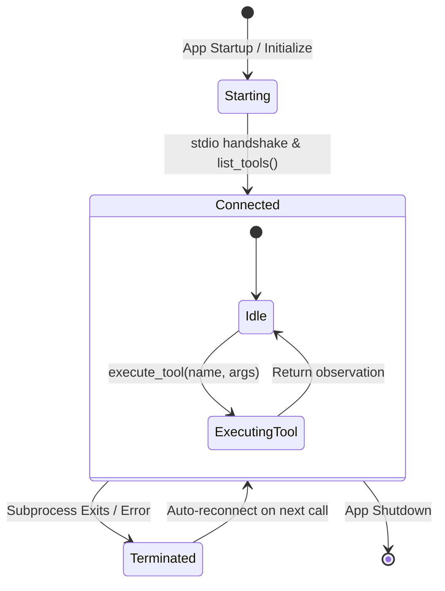

# Model Context Protocol (MCP) Integration & Protocol Architecture

The Multi-Agent Orchestrator Platform embeds a native host implementation of the **Model Context Protocol (MCP)** using the official Python SDK (`mcp`). It allows agents to inspect files, execute code in sandboxes, manipulate git repositories, and query persistent knowledge graphs via standardized JSON-RPC over `stdio`.

Implementation files:
- [app/mcp/client.py](file:///d:/MultiAgentOrchestrator/app/mcp/client.py): Stdio process management, session lifecycle, and error capture.
- [app/mcp/manager.py](file:///d:/MultiAgentOrchestrator/app/mcp/manager.py): Central MCP tool registry, permissions dispatcher, and workspace initializer.

---

## 1. Why MCP?

Traditional LLM tool integrations hardcode proprietary Python functions inside the agent runtime. MCP provides several distinct architectural advantages:

1. **Language-Agnostic Isolation**: Tools run as separate subprocesses (Node.js or Python) with dedicated memory spaces, ensuring that unstable tools or heavy dependencies (such as Jupyter kernels) cannot crash the main application.
2. **Standardized Tool Schemas**: MCP servers describe their own tools, parameter types, and descriptions dynamically via JSON-RPC.
3. **Plug-and-Play Extensibility**: New tools can be connected simply by adding their startup command to [conf.toml](file:///d:/MultiAgentOrchestrator/conf.toml).

---

## 2. Long-Lived Session Lifecycle

A common pitfall in MCP client implementations is spawning a new subprocess for every single tool invocation. This platform maintains **persistent, long-lived stdio sessions**:



### Why Persistent Sessions Are Critical:
1. **State Preservation**: The Python sandbox ([AirgappedPySandbox](https://github.com/HaJaehee/AirgappedPySandbox)) holds persistent IPython kernels. Variables, loaded DataFrames, and defined functions must persist across turns. Spawning a new process per call would wipe out all state.
2. **Performance**: Launching a Node.js runtime or initializing an IPython kernel takes 1–2 seconds. With persistent sessions, tool execution overhead is reduced to ~0.02 seconds.

### Task Ownership Model ([app/mcp/client.py](file:///d:/MultiAgentOrchestrator/app/mcp/client.py#L145-L150)):
In `anyio`, asynchronous cancel scopes are bound strictly to the task that created them. If a task opens an MCP stdio context and another task closes it, an unrecoverable runtime exception is raised. To guarantee safety:
- A dedicated background task (`_serve`) creates and owns the `stdio_client` and `ClientSession`.
- Caller tasks submit requests to the active session asynchronously, allowing concurrent, multiplexed tool calling.

---

## 3. Tool Discovery & Schema Conversion

### 3.1. Qualified Tool Names
To avoid collisions when multiple servers expose similarly named tools (e.g. `write_file`), the platform namespaces all tools using a double underscore:

$$\text{qualified\_name} = \text{server\_name} \text{\_\_} \text{tool\_name}$$

*Example*:
- `filesystem__write_file`
- `sandbox__execute_python_code`
- `git__git_diff`

### 3.2. Mapping to OpenAI Function Calling
[`MCPToolDefinition.to_openai_tool()`](file:///d:/MultiAgentOrchestrator/app/mcp/client.py#L124-L135) transforms native MCP JSON schemas into OpenAI-compatible tool specifications for LiteLLM:

```json
{
  "type": "function",
  "function": {
    "name": "sandbox__execute_python_code",
    "description": "[sandbox] Executes Python code inside a stateful IPython kernel...",
    "parameters": {
      "type": "object",
      "properties": {
        "code": { "type": "string", "description": "Python code to execute" }
      },
      "required": ["code"]
    }
  }
}
```

---

## 4. Permission Dispatching ([app/mcp/manager.py](file:///d:/MultiAgentOrchestrator/app/mcp/manager.py#L122-L138))

Each agent configuration defines `allowed_mcp_servers = ["filesystem", "sandbox"]`. When an agent turn begins:

```python
tools = mcp_manager.get_openai_tools_for_servers(agent.allowed_mcp_servers)
```

Only tools originating from servers explicitly authorized for that agent are passed into LiteLLM. An agent cannot call tools belonging to unlisted servers.
