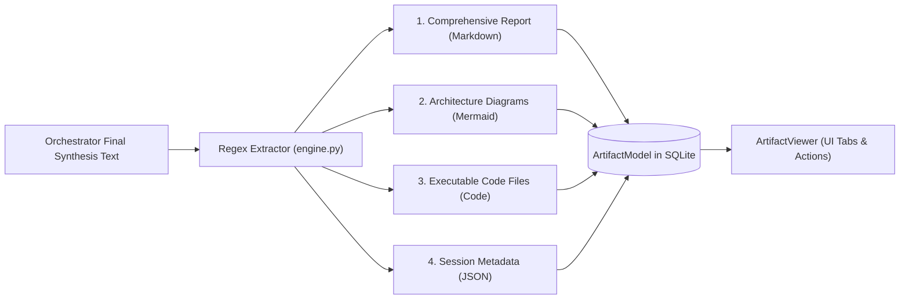

# Artifact Synthesis & Extraction

At the conclusion of a debate turn, the Master Orchestrator generates a comprehensive consensus synthesis. The engine parses this synthesis into discrete, typed **Artifacts** saved in the database and rendered interactively in the web UI.

---

## 1. Artifact Extraction Architecture

The extraction logic in [`_extract_artifacts_from_synthesis()`](file:///d:/MultiAgentOrchestrator/app/orchestration/engine.py#L372-L436) parses the Orchestrator's raw markdown text using regex tokenizers and categorizes outputs into four structured types:



---

## 2. Supported Artifact Types

### 2.1. Comprehensive Report (`markdown`)
- **Type**: `markdown`
- **Title**: `종합 아키텍처 & 산출물 보고서 (Final Synthesis Report)`
- **Content**: The full narrative report written by the Master Orchestrator, including executive summaries, decision matrices, edge-case audit findings, and verification steps.
- **Rendering**: Rendered as GitHub-flavored Markdown with table styling and syntax-highlighted code blocks.

### 2.2. Architecture Diagrams (`mermaid`)
- **Type**: `mermaid`
- **Title**: `시스템 아키텍처 다이어그램 #1`, `#2`, etc.
- **Extraction Pattern**: Blocks fenced with ` ```mermaid ... ``` `.
- **Rendering**: Rendered into interactive SVG diagrams via NiceGUI's embedded Mermaid.js renderer.
- **Supported Diagrams**: Flowcharts (`graph TD/LR`), Sequence Diagrams (`sequenceDiagram`), State Diagrams (`stateDiagram-v2`), and Entity-Relationship Diagrams (`erDiagram`).

### 2.3. Executable Code Files (`code`)
- **Type**: `code`
- **Title**: `핵심 구현 소스코드 ({language}) #1`, `#2`, etc.
- **Extraction Pattern**: Code blocks matching languages: `python`, `py`, `typescript`, `javascript`, `bash`, `shell`, `json`, `toml`, `sql`.
- **Rendering**: Displayed with language-specific syntax highlighting, line numbers, and a dedicated **"Copy Code"** button.

### 2.4. Session Metadata & Summary (`json`)
- **Type**: `json`
- **Title**: `세션 메타데이터 & 토론 요약 (JSON)`
- **Content**: Auto-generated structured session record:
  ```json
  {
    "session_id": "9efca23a-f10d-45db-90cf-195b6cfa4521",
    "goal": "Design a real-time event streaming pipeline...",
    "strategy": "sequential_review",
    "total_rounds": 3,
    "participating_agents": ["orchestrator", "architect", "coder", "critic"],
    "total_messages": 11,
    "consensus_reached": true
  }
  ```

---

## 3. Storage & UI Integration

- **Database Entity**: Each extracted item is committed as an [`ArtifactModel`](file:///d:/MultiAgentOrchestrator/app/database/models.py#L80-L92) record linked via foreign key to `sessions.id`.
- **UI Viewer**: Rendered in [`ArtifactViewer`](file:///d:/MultiAgentOrchestrator/app/ui/components/artifact_viewer.py) as tabbed cards on the right-hand panel of the workspace. Users can switch between tabs, copy snippets, or download raw files with a single click.
