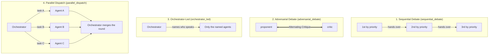

# Debate Strategies

A strategy answers two questions for every round: **who speaks, in what order**, and **what
instruction is attached to each turn**. It never decides *what* an agent says — that comes from
the agent's persona and the transcript. One strategy also answers a third: **do they speak one
at a time, or all at once** (`parallel_dispatch`).

The orchestrator is not part of a round. It plans before round 1 and synthesises after the last
round, so every strategy excludes it from the speaker list.

---

## 1. Where the order comes from

Order and stance live on the agent, not in the strategy. Both are `agents.<key>` fields in
`conf.json`, both are editable from the roster, and both are frozen into the session snapshot
when a conversation starts.

| Field | Meaning | Edited by |
|-------|---------|-----------|
| `debate_priority` | Speaking order inside a round; lower speaks earlier. Ties keep `conf.json` order. | Dragging agent cards in the roster |
| `debate_stance` | `proponent` / `critic` / `neutral` — used by the adversarial strategy | The ⋮ menu on an agent card |

> **Why not hardcode the order?** It used to be `{"architect": 0, "coder": 1, "critic": 2}`
> inside the strategy. Once agents could be created from the UI, every key missing from that
> table collapsed to the same priority and was pushed to the back — and in the adversarial
> strategy it fell into `others`, neither proposing nor critiquing. The only agent key left in
> `strategies.py` is `orchestrator`, and that is structural rather than a role.

---

## 2. Built-In Debate Strategies



### 2.1. Sequential Debate (`sequential_debate`)
- **Key**: `sequential_debate`
- **Display Name**: 순차 토론 (Sequential Debate)
- **Speaker Order**: every active specialist, ordered by `debate_priority`.
- **Turn Instruction**: each speaker is told to take the **previous speaker's conclusion as
  input** — naming them explicitly — and either build on it or challenge it. The first speaker
  is asked to separate conclusions from assumptions; the last is asked to close the round.
- **Characteristics**: one pass per round with an explicit hand-off, so somebody always owns
  the previous conclusion.
- **Ideal For**: feature development, skeleton projects, formal design workflows.

> This strategy is the merger of the former `free_debate` and `sequential_review`. Once ordering
> moved to `debate_priority`, the two called the same agents in the same order, and the only
> difference left was the hand-off instruction — so "free debate" was not free, it was simply an
> unlabelled sequential pass. Sessions stored under either old key are mapped here by
> `resolve_strategy_name()`.

### 2.2. Adversarial Debate (`adversarial_debate`)
- **Key**: `adversarial_debate`
- **Display Name**: 디베이트 (Debate & Critique)
- **Speaker Order**: interleaves `proponent` agents with `critic` agents, each side internally
  ordered by `debate_priority`; `neutral` agents speak after the clash.
- **Turn Instruction**: stance-specific — proponents propose and answer challenges head-on;
  critics must produce reproducible counter-examples rather than vague concerns.
- **Fallback**: if either side is empty, there is nothing to alternate, so it degrades to a
  single priority-ordered pass. Nobody is ever silenced by an unset stance.
- **Ideal For**: threat modelling, architectural refactoring, verifying critical algorithms.

### 2.3. Orchestrator-Led (`orchestrator_led`)
- **Key**: `orchestrator_led`
- **Display Name**: 오케스트레이터 지명 (Orchestrator-Led)
- **Speaker Order**: decided per round by the orchestrator, which is given the transcript so far
  and the roster and asked to name **only the agents this round needs**. Unlike the other
  strategies, not everyone speaks every round — one name is a valid answer.
- **Recorded**: the names, the stated reason, and who was *not* called all land in the feed.
- **Implementation note**: the selection call goes out on a copy of the orchestrator with tools
  and sequential thinking **disabled**. It is a routing question, not a speech — with tools
  attached it starts reading files, and with the step-by-step protocol injected it writes
  `Thought 1..N` instead of the requested JSON.
- **Robustness**: a non-JSON answer is scraped for known agent keys in order of appearance. If
  the endpoint is unreachable, or no known key is found, it falls back to `debate_priority`
  order **and records that it did** — silently running a different order is the worst outcome.
- **Ideal For**: long, open-ended sessions where calling every agent every round wastes tokens.

### 2.4. Parallel Dispatch (`parallel_dispatch`)
- **Key**: `parallel_dispatch`
- **Display Name**: 병렬 지시 (Orchestrator Parallel Dispatch)
- **Round shape**: dispatch → concurrent execution → merge. The other three strategies run one
  speaker at a time, so a round costs the *sum* of the turns; here it costs the *slowest* one.
- **Dispatch**: the orchestrator is asked for a per-agent task
  (`{"assignments": [{"agent": ..., "task": ...}], "reason": ...}`), told that the named agents
  answer simultaneously and that overlapping tasks mean duplicated work. Calling one agent is a
  valid answer; calling everyone is not required.
- **What each agent sees**: its own task, plus a board of **who else is working on what** — but
  none of their answers. Every prompt for the round is built *before* the first coroutine
  starts, so a fast sibling's reply cannot leak into a slower one's context. Agents are told to
  state assumptions rather than guess at another agent's output.
- **Merge**: after the round the orchestrator writes an interim synthesis — combined conclusion,
  contradictions and how they are judged, unverified assumptions, open items. That message is
  the input to the next round's dispatch. Without it nobody in the debate has ever seen the
  round as a whole, and contradictions survive to the final synthesis.
- **Concurrency limit**: `sessions.parallel_limit` (UI: **동시 실행**, default 3) caps how many
  run at once via an `asyncio.Semaphore`; extra assignments queue rather than being dropped.
  A local single-GPU endpoint (Ollama, vLLM, LM Studio) turns five simultaneous requests into
  timeouts, which surface as "the agent did not answer".
- **Robustness**: an unreachable endpoint or an unparseable dispatch falls back to running
  *everyone concurrently without tasks* — the dispatch was lost, not the parallelism — and the
  fallback is recorded in the feed. A broken `assignments` array is still scraped for known
  agent keys. With only one specialist active, no dispatch call is made at all.
- **Human interjections and stop**: honoured at **round boundaries only**. The other strategies
  can look between speakers; here that gap does not exist because everyone is already running.
  A stop request during a round skips the interim merge and goes straight to final synthesis.
- **Ideal For**: independent workstreams that do not need each other's output within the round —
  design + skeleton + threat review of the same feature, or auditing several modules at once.

> **Implementation notes.** Parallel speaking breaks two assumptions the sequential engine could
> take for granted. Concurrent `db.add`/`commit` on the shared `AsyncSession` raises
> `IllegalStateChangeError`, so `_speak()` takes a `db_lock` covering the record block only —
> the LLM call stays outside it. And because messages are reloaded in `created_at` order,
> finishing order would otherwise reshuffle the transcript on every refresh; `_speak()` accepts
> an explicit `created_at` stamped in dispatch order, and `state.messages` is re-sorted to match.

---

## 3. Adding a Custom Debate Strategy

1. Subclass `BaseDebateStrategy` in [app/orchestration/strategies.py](file:///d:/MultiAgentOrchestrator/app/orchestration/strategies.py):
   ```python
   class ConsensusVotingStrategy(BaseDebateStrategy):
       name = "consensus_voting"
       display_name = "합의 투표 (Consensus Voting)"

       def get_speakers_for_round(self, active_agents, round_num, state):
           # `specialists_of` drops the orchestrator; `order_by_priority` applies debate_priority.
           return order_by_priority(specialists_of(active_agents))

       def turn_instruction(self, agent, speakers, index, state):
           return "[투표] 앞선 제안 중 하나를 고르고 그 이유를 밝히세요."
   ```
   Read `debate_priority` / `debate_stance` off the agent rather than matching on `agent.key` —
   agent keys are user-defined and a key you hardcode today may not exist tomorrow.
2. Register it in `STRATEGY_MAP`:
   ```python
   STRATEGY_MAP["consensus_voting"] = ConsensusVotingStrategy()
   ```
   The strategy appears in the web UI dropdown immediately and becomes selectable for any
   session.
3. If your strategy needs an LLM call to pick speakers, set
   `orchestrator_selects_speakers = True` instead of calling the model from the strategy —
   strategies stay pure, and the engine performs the call (and the fallback) in
   `OrchestratorEngine._select_speakers()`. For a round that runs its speakers concurrently, set
   `orchestrator_dispatches_parallel = True`; the engine then runs the whole round through
   `OrchestratorEngine._run_parallel_round()` (dispatch, `asyncio.gather` under the session's
   `parallel_limit`, interim merge) instead of the one-speaker-at-a-time loop.
4. If you retire a strategy key that sessions may already hold, add it to
   `LEGACY_STRATEGY_ALIASES` so those conversations keep running.
