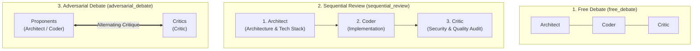

# Multi-Agent Debate Strategies

Debate strategies define how specialist agents are scheduled to speak during Phase 2 of the orchestration lifecycle. Implemented in [app/orchestration/strategies.py](file:///d:/MultiAgentOrchestrator/app/orchestration/strategies.py), strategies control the flow of ideas, verification order, and critique mechanisms.

---

## 1. Strategy Interface ([BaseDebateStrategy](file:///d:/MultiAgentOrchestrator/app/orchestration/strategies.py#L7-L24))

Every strategy implements the abstract base class:

```python
class BaseDebateStrategy(ABC):
    @property
    @abstractmethod
    def name(self) -> str: ...

    @property
    @abstractmethod
    def display_name(self) -> str: ...

    @abstractmethod
    def get_speakers_for_round(
        self, active_agents: List[Agent], round_num: int, state: DebateState
    ) -> List[Agent]:
        """Returns the ordered list of specialist agents who speak in this round."""
        ...
```

The Master Orchestrator is intentionally excluded from the intermediate speaker list returned by `get_speakers_for_round()` because it moderates before (Phase 1) and after (Phase 3) the debate.

---

## 2. Built-In Debate Strategies



### 2.1. Free Debate (`free_debate`)
- **Key**: `free_debate`
- **Display Name**: 자유 토론 (Free Debate)
- **Speaker Order**: All active specialist agents speak in their registration order.
- **Characteristics**: Fluid, collaborative, and unstructured. Agents respond organically to preceding arguments.
- **Ideal For**: Brainstorming, high-level feasibility studies, and multi-domain exploration.

### 2.2. Sequential Review (`sequential_review`)
- **Key**: `sequential_review`
- **Display Name**: 순차 검증 (Sequential Review)
- **Speaker Order**: Strictly prioritizes the standard software development lifecycle:
  $$\text{Architect} \longrightarrow \text{Coder} \longrightarrow \text{Critic}$$
- **Characteristics**:
  - The **Architect** defines module boundaries, schemas, and patterns.
  - The **Coder** implements code adhering to the architecture.
  - The **Critic** audits the code and architecture for vulnerabilities, performance bottlenecks, and edge cases.
- **Ideal For**: Production feature development, skeleton project creation, and formal design workflows.

### 2.3. Adversarial Debate (`adversarial_debate`)
- **Key**: `adversarial_debate`
- **Display Name**: 디베이트 (Debate & Critique)
- **Speaker Order**: Interleaves proponents (`architect`, `coder`) with critics (`critic`):
  $$\text{Proponent}_1 \longrightarrow \text{Critic}_1 \longrightarrow \text{Proponent}_2 \longrightarrow \text{Critic}_2$$
- **Characteristics**: Creates an alternating debate format where proposals are immediately tested, challenged, and stress-tested.
- **Ideal For**: Security threat modeling, architectural refactoring, and verifying mission-critical algorithms.

---

## 3. Adding a Custom Debate Strategy

To add a new strategy (e.g. a Round-Robin or Voting strategy):

1. Subclass `BaseDebateStrategy` in [app/orchestration/strategies.py](file:///d:/MultiAgentOrchestrator/app/orchestration/strategies.py):
   ```python
   class ConsensusVotingStrategy(BaseDebateStrategy):
       name = "consensus_voting"
       display_name = "합의 투표 (Consensus Voting)"

       def get_speakers_for_round(self, active_agents, round_num, state):
           specialists = [a for a in active_agents if a.key != "orchestrator"]
           # Custom ordering or filtering logic
           return specialists
   ```
2. Register it in `STRATEGY_MAP`:
   ```python
   STRATEGY_MAP["consensus_voting"] = ConsensusVotingStrategy()
   ```
The strategy will instantly appear in the web UI dropdown and become selectable for any session.
