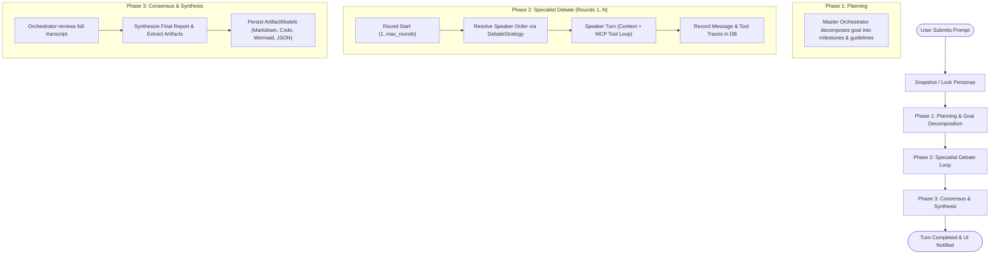

# Orchestration Engine & Execution Lifecycle

The [`OrchestratorEngine`](file:///d:/MultiAgentOrchestrator/app/orchestration/engine.py#L33-L436) coordinates the multi-agent debate workflow, turn management, database synchronization, and artifact synthesis. It implements an asynchronous state machine inspired by StateGraph patterns.

---

## 1. The 3-Phase Orchestration Workflow

Every user prompt initiates a 3-phase execution turn:



---

## 2. Phase Breakdown

### Phase 1: Planning & Goal Decomposition
1. The user's input is saved as a `MessageModel` with `sender_key = "user"` and `round_number = 0`.
2. The engine invokes the **Master Orchestrator** with a planning prompt.
3. The Orchestrator deconstructs the request, identifies system constraints, and assigns specific responsibilities to each participating specialist (Architect, Coder, Critic).
4. The plan is streamed to the UI and committed to the database.

### Phase 2: Multi-Round Specialist Debate Loop
For each round $r \in [1, \text{max\_rounds}]$:
1. The active strategy (e.g. `sequential_review`) determines the speaker order.
2. For each agent in the speaker list:
   - [`_build_context_for_agent()`](file:///d:/MultiAgentOrchestrator/app/orchestration/engine.py#L330-L352) creates a structured discussion transcript labeled by speaker name and role.
   - The agent executes its turn using [`LLMCaller.call_agent()`](file:///d:/MultiAgentOrchestrator/app/agents/llm.py).
   - If the agent calls MCP tools (e.g. reading files or executing code in the sandbox), every tool invocation is stored in the database (`ToolCallRecordModel`) and streamed to the UI as a real-time event.
   - The agent's final text response is saved in the database (`MessageModel`) and appended to the debate feed.

### Phase 3: Consensus & Synthesis
1. Once all debate rounds conclude, the engine transitions to `status = "synthesizing"`.
2. The **Master Orchestrator** receives the complete transcript of the debate.
3. The Orchestrator synthesizes the consensus, integrating architectural proposals, code revisions, and security audit recommendations.
4. [`_extract_artifacts_from_synthesis()`](file:///d:/MultiAgentOrchestrator/app/orchestration/engine.py#L372-L436) parses the output, extracting code blocks, Mermaid diagrams, and JSON summaries into individual [`ArtifactModel`](file:///d:/MultiAgentOrchestrator/app/database/models.py#L80-L92) records.
5. The state status is marked `completed` with `is_consensus_reached = True`.

---

## 3. Real-Time Event Dispatching

The engine communicates with the UI layer through an asynchronous event callback (`EventCallback`):

```python
async def on_event(event: Dict[str, Any]) -> None:
    ...
```

### Event Specification:

| Event Type | Payload Attributes | UI Reaction |
| :--- | :--- | :--- |
| `status_changed` | `status`, `speaker`, `round` | Updates progress banner in the chat header. |
| `round_started` | `round`, `max_rounds` | Displays round transition notifications. |
| `message_added` | `message` dictionary | Appends new color-coded message bubble to feed. |
| `tool_executed` | `agent_key`, `agent_name`, `tool_call` | Appends collapsible accordion item showing input & output. |
| `artifacts_synthesized` | `artifacts` list | Populates code, markdown, and Mermaid tabs in Artifact Viewer. |
| `turn_completed` | `status: "completed"` | Re-enables user input and marks personas locked. |
