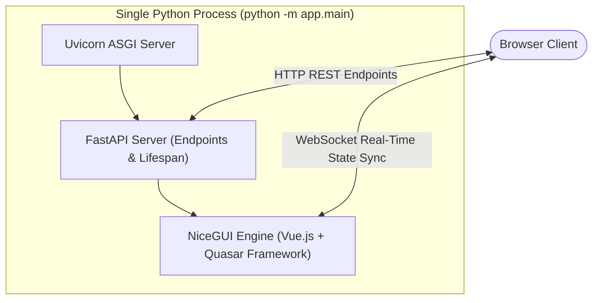

# Reactive Web UI: NiceGUI & FastAPI Integration

The user interface of the MADO: Multi-Agent Debate & Orchestration Platform is implemented with [NiceGUI](https://nicegui.io/) embedded directly within a [FastAPI](https://fastapi.tiangolo.com/) application.

---

## 1. Unified Single-Process Architecture

Unlike typical AI applications that require a separate Node.js frontend (React/Vue/Next.js) and a Python backend, this platform unifies frontend and backend in a **single Python process**:



### Advantages:
1. **Zero Node.js Build Pipeline**: No Vite, Webpack, or npm build steps required to run or package the frontend.
2. **True Full-Stack Python**: UI logic, data models, state management, and backend orchestration share the same Python objects and async event loop.
3. **Low-Latency Streaming**: NiceGUI leverages persistent WebSockets to push token streams, tool logs, and state updates from Python to the client DOM with sub-millisecond overhead.

---

## 2. Page Routing & Mounting

The application registers two primary NiceGUI pages in [app/main.py](file:///d:/MultiAgentOrchestrator/app/main.py#L144-L151):

```python
create_ui()              # Registers "/" (Main Workspace)
create_personas_page()   # Registers "/personas/{session_id}" (Persona Editor)

ui.run_with(
    server,
    title="MADO: Multi-Agent Debate & Orchestration Platform",
    favicon=FAVICON_SVG,
    dark=True,
)
```

### Route Map:
- **`GET /`**: Main interactive workspace featuring the session history sidebar, agent roster controls, debate feed, and artifact viewer tabs.
- **`GET /personas/{session_id}`**: Dedicated session persona editor where users can customize names, roles, and system prompts before starting a debate.
- **`GET /api/*`**: Asynchronous REST endpoints (`/api/health`, `/api/agents`, `/api/mcp`, `/api/sessions/{session_id}/personas`) available for automated monitoring and headless integration.

---

## 3. Styling & Theme Engine ([app/ui/theme.py](file:///d:/MultiAgentOrchestrator/app/ui/theme.py))

The UI uses Quasar Framework components styled with custom CSS:
- **Dark Mode**: Forced system-wide dark palette with dark background (`#121212`), elevated card surfaces (`#1e1e1e`), and high-contrast typography.
- **Agent Avatars & Badges**: Each agent has distinct visual indicators (e.g. Indigo for Orchestrator, Teal for Architect, Deep Purple for Coder, Amber for Critic).
- **Collapsible Tool Accordions**: Tool invocations collapse into clean accordions with colored status badges (Green for `success`, Red for `error`), keeping the main debate timeline readable.
